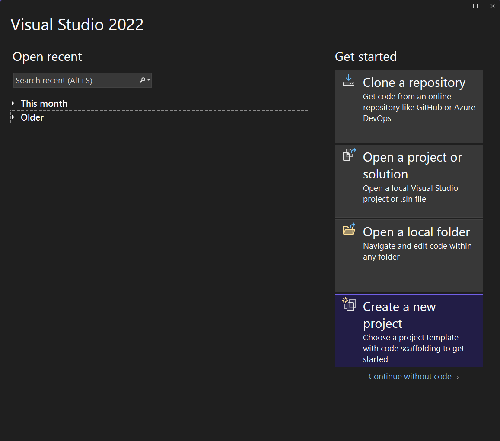
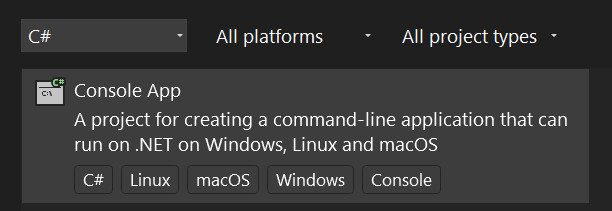
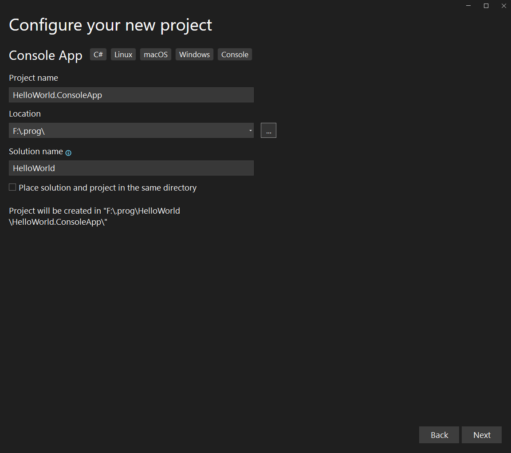
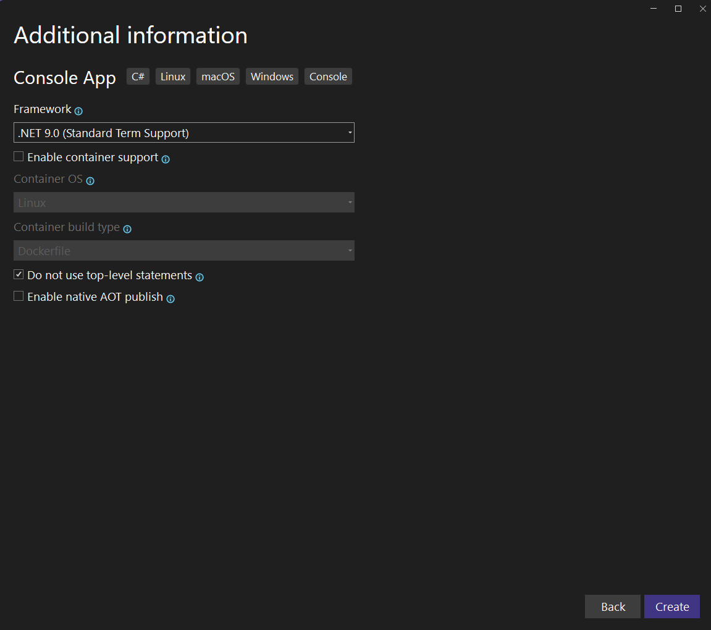
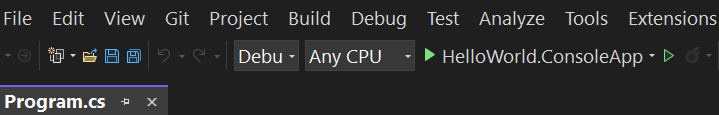
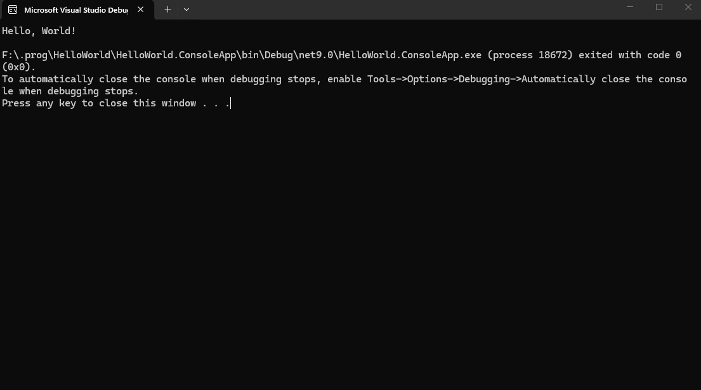

"Hello World" (Olá, Mundo) é o programa de computador mais simples e clássico, usado para exibir essa frase na tela, servindo como o primeiro passo no aprendizado de qualquer linguagem de programação.

## Criando o Projeto

Abra o Visual Studio.

Na tela inicial:

1. Clique em Create a new project



---

2. Na barra de busca, digite: `console`



---

3. Selecione `Console App`

(Escolha a versão em C#, não C++)

Clique em `Next`.

## Configurando o Projeto

Agora você precisa definir:

- `Project name` → Exemplo: HelloWorld.ConsoleApp
- `Location` → Pasta onde o projeto será salvo
- `Solution name` → Pode deixar igual ao nome do projeto, porém tire o sufixo

Clique em `Next`.



## Escolhendo a versão do .NET

Selecione a versão mais recente disponível, por exemplo:

- .NET 9
- .NET 10 (se disponível)

Clique em `Create`.



## O código gerado automaticamente

O Visual Studio cria um projeto com o chamado Program.cs contendo o seguinte comando:

```cs
Console.WriteLine("Hello, World!");
```

## Executando a Aplicação

Para ver o código funcionando, você pode clicar no botão verde que contém o nome do projeto `HelloWorld.ConsoleApp`:



Ao executar, você deve ver a seguinte janela aberta:


