## Estrutura de Projeto Modular Monolítica

Nas aulas anteriores, construímos aplicações com:

- Controllers;
- Views;
- ViewModels;
- validações;
- repositórios;
- injeção de dependência.

Esses recursos ajudam a implementar as funcionalidades.

Mas existe outra pergunta importante:

> como organizar todos esses arquivos quando a aplicação começa a crescer?

Uma aplicação pequena pode funcionar com poucos arquivos na raiz do projeto.

Conforme novas funcionalidades são adicionadas, essa organização começa a dificultar a localização do código.

Um Controller pode ficar distante do seu Model.

Um repositório pode ficar misturado com repositórios de outros assuntos.

As Views podem ser difíceis de encontrar.

Para lidar com esse crescimento, podemos organizar o projeto em módulos.

Nesta aula, usaremos o projeto `gestao-de-equipamentos-webapp-2026`, na versão `v1`, como referência para explicar essas decisões.

## O que é arquitetura de software?

Arquitetura de software é a forma como decidimos organizar uma aplicação.

Ela define, por exemplo:

- quais partes existem no sistema;
- qual responsabilidade pertence a cada parte;
- como as partes se comunicam;
- quais dependências são permitidas;
- como a aplicação será executada e publicada.

Arquitetura não é apenas o nome das pastas.

Uma boa estrutura também define limites para evitar que qualquer parte do sistema conheça todos os detalhes das outras partes.

Podemos pensar em duas perguntas diferentes:

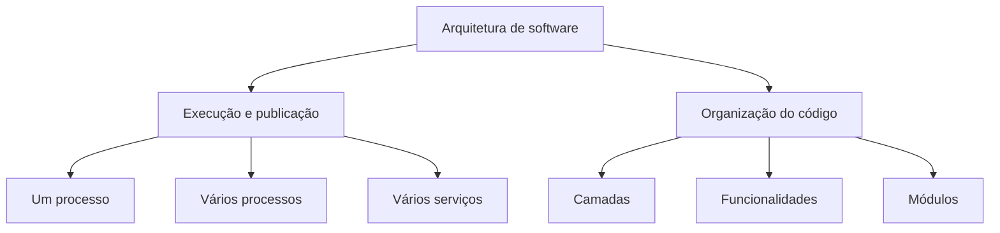

Essas perguntas estão relacionadas, mas não significam a mesma coisa.

## O que é um monólito?

Uma aplicação monolítica é publicada como uma unidade.

Normalmente, ela possui:

- um projeto executável principal;
- um processo para executar a aplicação;
- uma publicação da aplicação;
- um ponto de entrada, como o `Program.cs`.

No ASP.NET Core MVC, um monólito pode ser uma aplicação Web que contém:

- Controllers;
- Views;
- Models;
- ViewModels;
- repositórios;
- configurações;
- recursos estáticos.

Quando publicamos a aplicação, todos esses elementos são executados juntos.

Isso não significa que o código precise ficar misturado.

Um monólito pode ser organizado em pastas e módulos bem definidos.

> Monólito descreve principalmente a unidade de execução e publicação. Ele não significa necessariamente código desorganizado.

## O que é um monólito modular?

Um monólito modular continua sendo uma única aplicação para execução e publicação.

Porém, o código é separado internamente em módulos relacionados a funcionalidades do negócio.

Cada módulo concentra os elementos de um assunto específico.

Um módulo de equipamentos pode conter:

- a entidade `Equipamento`;
- o `EquipamentoController`;
- as ViewModels de equipamento;
- o repositório de equipamento;
- as Views de equipamento.

Um módulo de chamados pode conter os elementos relacionados aos chamados.

As funcionalidades continuam no mesmo projeto WebApp.

Mas cada funcionalidade possui um espaço próprio.

Podemos representar a ideia assim:

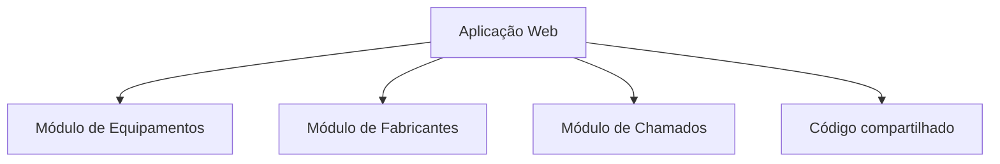

Os módulos são separados no código.

A aplicação continua sendo publicada como uma unidade.

## Monólito modular não é microserviço

É comum confundir um módulo com um microserviço.

Eles não são a mesma coisa.

Um módulo de um monólito normalmente:

- está no mesmo projeto ou na mesma aplicação;
- é iniciado junto com os outros módulos;
- utiliza o mesmo processo da aplicação;
- é publicado junto com os outros módulos;
- pode compartilhar configurações e infraestrutura.

Um microserviço normalmente:

- é uma aplicação independente;
- possui seu próprio processo;
- pode ser publicado separadamente;
- possui comunicação de rede com outros serviços;
- pode ter ciclo de vida e armazenamento próprios.

Podemos comparar as duas estruturas:

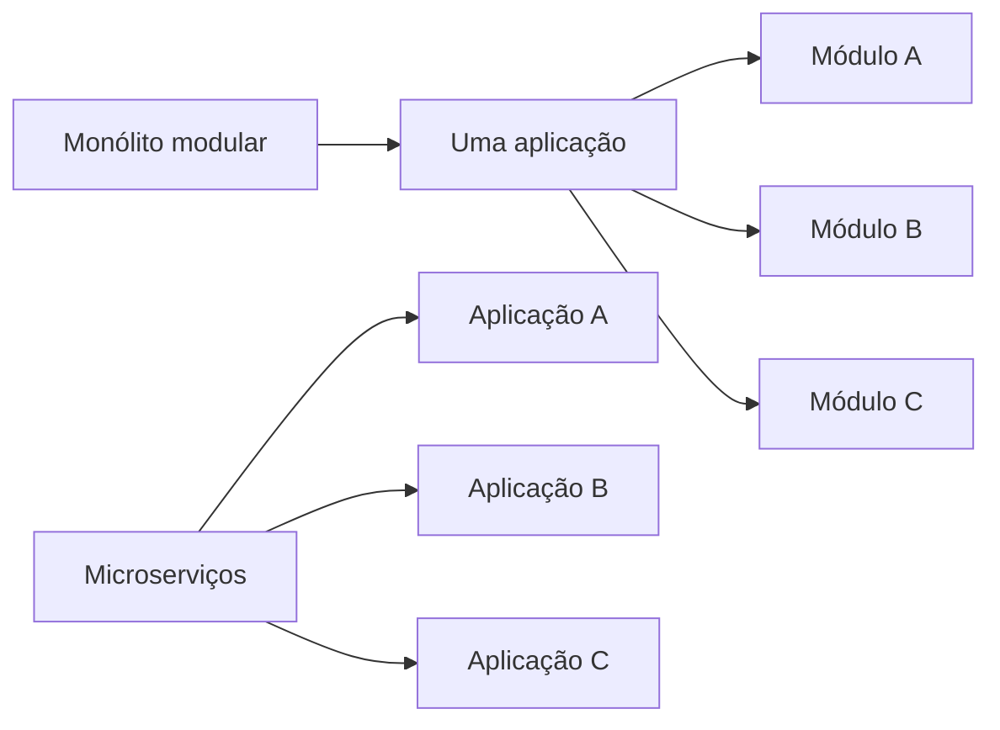

O monólito modular costuma ser uma solução adequada quando o sistema ainda precisa de uma implantação simples.

Ele permite organizar o código sem introduzir imediatamente a complexidade de vários serviços.

## Por que organizar por módulos?

Considere uma aplicação que possui estas funcionalidades:

- equipamentos;
- fabricantes;
- equipamentos;
- chamados.

Se todos os arquivos forem colocados em pastas genéricas, podemos ter uma estrutura como:

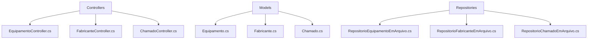

Essa organização separa os arquivos por tipo técnico.

Para encontrar tudo sobre equipamentos, precisamos procurar em várias pastas.

Também pode ser difícil perceber quais arquivos formam uma funcionalidade completa.

Uma organização por módulos aproxima os arquivos pelo assunto:

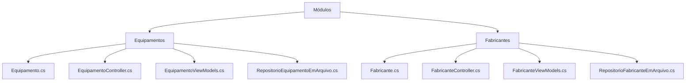

Agora, os arquivos necessários para trabalhar com equipamentos estão próximos.

Essa forma de organização é chamada de **organização orientada a funcionalidades** ou **feature-based organization**.

## O módulo representa uma funcionalidade

Um módulo deve representar um assunto reconhecível no domínio da aplicação.

Exemplos:

- equipamentos;
- fabricantes;
- equipamentos;
- chamados;

O nome do módulo não deve ser escolhido apenas pelo tipo técnico do arquivo.

Um módulo chamado `Controllers` não representa uma funcionalidade.

Ele representa apenas um tipo de código.

Já `ModuloEquipamentos` representa um assunto do sistema.

Dentro desse módulo podem existir diferentes tipos de arquivo, pois todos estão relacionados à mesma funcionalidade.

> O módulo deve responder à pergunta: qual parte do negócio este conjunto de arquivos implementa?

## Código compartilhado

Nem todo código pertence a um único módulo.

Alguns elementos podem ser utilizados por várias funcionalidades.

Por exemplo:

- configuração geral da aplicação;
- classe base de entidades;
- contexto de persistência;
- configuração de injeção de dependência;
- componentes visuais compartilhados;
- recursos comuns de apresentação.

Esses elementos podem ficar em uma área chamada `Compartilhado`.

Uma estrutura inicial pode ser:

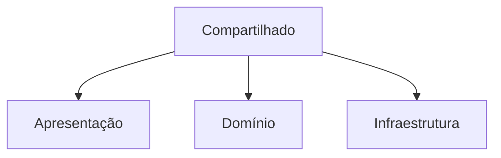

O código compartilhado deve ser pequeno e possuir uma responsabilidade clara.

Não devemos mover qualquer classe para `Compartilhado` apenas porque não sabemos onde colocá-la.

Uma pasta compartilhada sem regras pode se transformar em uma nova pasta de arquivos misturados.

## Conhecendo o projeto de gestão de equipamentos

O repositório [`gestao-de-equipamentos-webapp-2026`, versão `v1`](https://github.com/academiadoprogramador-backend/gestao-de-equipamentos-webapp-2026/tree/v1) apresenta a base de uma aplicação ASP.NET Core MVC.

Sua solução possui um projeto WebApp:

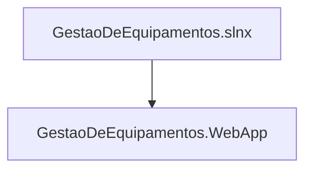

Dentro do projeto, a estrutura inicial contém:

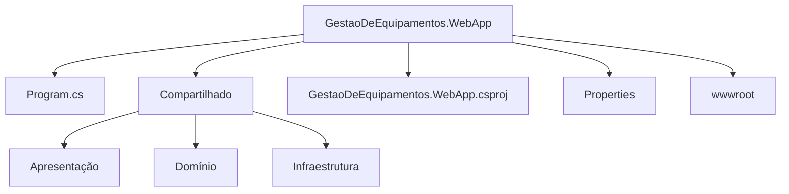

Essa estrutura já possui uma preocupação importante.

Ela separa o código compartilhado em áreas relacionadas a:

- apresentação;
- domínio;
- infraestrutura.

## A pasta Compartilhado da referência

Na versão `v1`, a pasta `Compartilhado` possui três partes principais.

### Apresentacao

A pasta `Compartilhado/Apresentacao` contém elementos da interface geral da aplicação.

Na referência, encontramos:

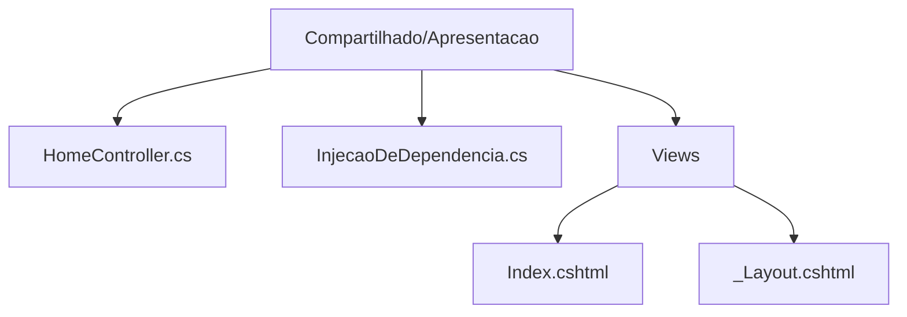

O `HomeController` e as Views iniciais pertencem à apresentação comum da aplicação.

O `_Layout.cshtml` pode ser utilizado como estrutura visual compartilhada pelas páginas.

O arquivo `InjecaoDeDependencia.cs` configura o MVC e o mecanismo de localização das Views.

### Dominio

A pasta `Compartilhado/Dominio` possui a classe base de entidades:

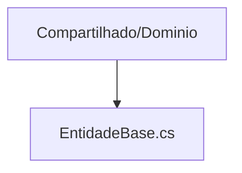

O código da referência apresenta uma classe abstrata semelhante a esta:

```csharp
public abstract class EntidadeBase
{
    public int Id { get; set; }

    public abstract void Atualizar(EntidadeBase entidadeAtualizada);
}
```

Uma classe base pode concentrar características comuns às entidades.

Ela não deve receber regras específicas de um módulo.

Por exemplo, a regra para atualizar um equipamento deve ficar no módulo de equipamentos, não na classe compartilhada.

### Infraestrutura

A pasta `Compartilhado/Infraestrutura` concentra elementos relacionados ao funcionamento técnico da aplicação:

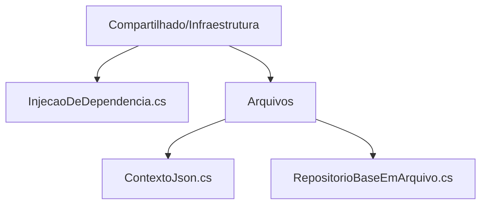

O `ContextoJson` representa o contexto de dados carregados de arquivos.

O `RepositorioBaseEmArquivo` pode fornecer comportamentos comuns para repositórios que utilizam essa forma de persistência.

Esses elementos não representam uma funcionalidade específica, como equipamentos ou usuários.

Por isso, eles podem ficar no código compartilhado de infraestrutura.

## O papel do Program.cs

O `Program.cs` é o ponto de entrada da aplicação.

Ele deve configurar a aplicação, mas não precisa conhecer cada detalhe de todas as funcionalidades.

Na versão `v1`, o `Program.cs` delega a configuração para métodos de extensão:

```csharp
var builder = WebApplication.CreateBuilder(args);

builder.Services.AdicionarCamadaDeInfraestrutura();
builder.Services.AdicionarCamadaDeApresentacao();

var app = builder.Build();

app.UseRouting();
app.MapDefaultControllerRoute();
app.UseStaticFiles();

app.Run();
```

O código possui duas ideias importantes:

- a infraestrutura registra os serviços técnicos;
- a apresentação registra o MVC e suas opções.

O `Program.cs` funciona como ponto de composição.

Ele conecta as partes da aplicação sem concentrar toda a implementação nelas.

## Configuração da apresentação para módulos

O arquivo de injeção de dependência da apresentação da referência configura os locais em que o MVC deve procurar as Views.

A ideia pode ser representada assim:

```csharp
services.AddControllersWithViews().AddRazorOptions(options =>
{
    options.ViewLocationFormats.Clear();

    options.ViewLocationFormats.Add(
        "/Compartilhado/Apresentacao/Views/{0}.cshtml"
    );

    options.ViewLocationFormats.Add(
        "/Modulos/{1}s/Apresentacao/Views/{0}.cshtml"
    );
});
```

O primeiro caminho permite localizar Views compartilhadas, como a página inicial e o layout.

O segundo caminho prepara a localização das Views de módulos.

Nesse formato, uma View de um Controller de equipamentos poderia ficar em um caminho semelhante a:

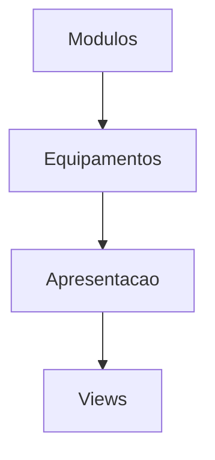

Na versão `v1`, esse local é uma preparação para os módulos que serão adicionados posteriormente.

Isso é importante:

> configurar o local das Views não cria um módulo automaticamente. O módulo ainda precisa conter seus próprios elementos.

## A versão v1 ainda é uma base

Ao analisar o repositório de gestão de equipamentos na versão `v1`, observamos que ele possui a estrutura compartilhada e a configuração para módulos.

Mas a versão inicial ainda não apresenta vários módulos de negócio completos.

Isso não é um problema.

Uma arquitetura também pode ser preparada antes de todas as funcionalidades serem implementadas.

A evolução esperada pode ser representada assim:

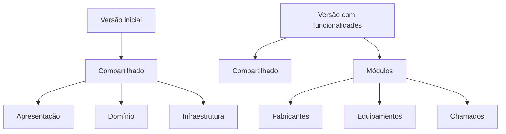

O objetivo da estrutura inicial é oferecer um lugar claro para cada nova parte do sistema.

## Camadas e módulos são dimensões diferentes

Uma aplicação pode ser organizada por camadas ou por módulos.

Podemos representar as duas dimensões assim:

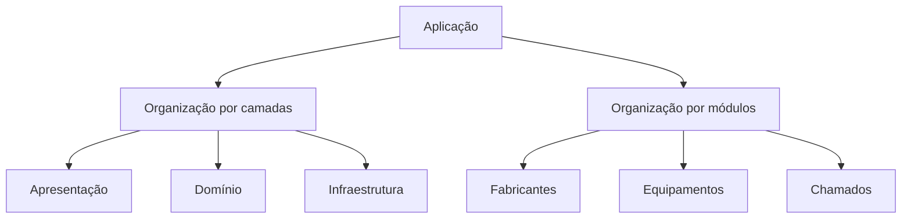

Também podemos combinar as duas ideias em cada módulo:

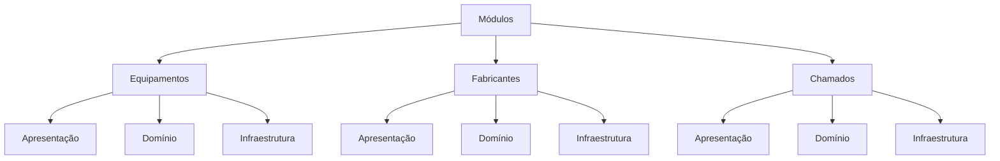

Nesse modelo, cada módulo possui suas próprias camadas.

O código compartilhado permanece fora dos módulos:


Essa combinação pode ser útil quando a aplicação possui regras de negócio mais complexas.

Para aplicações menores, não precisamos criar todas essas pastas imediatamente.

Devemos começar com uma estrutura simples e adicionar separações quando elas trouxerem clareza.

## Dependências entre as partes

Organizar arquivos em pastas não é suficiente.

Também precisamos pensar em quais partes podem conhecer umas às outras.

Um fluxo possível em um módulo de equipamentos é:


O Controller recebe o repositório por injeção de dependência.

O repositório recebe o contexto de persistência.

O `Program.cs` ou uma classe de configuração registra essas dependências.

Podemos representar as responsabilidades assim:

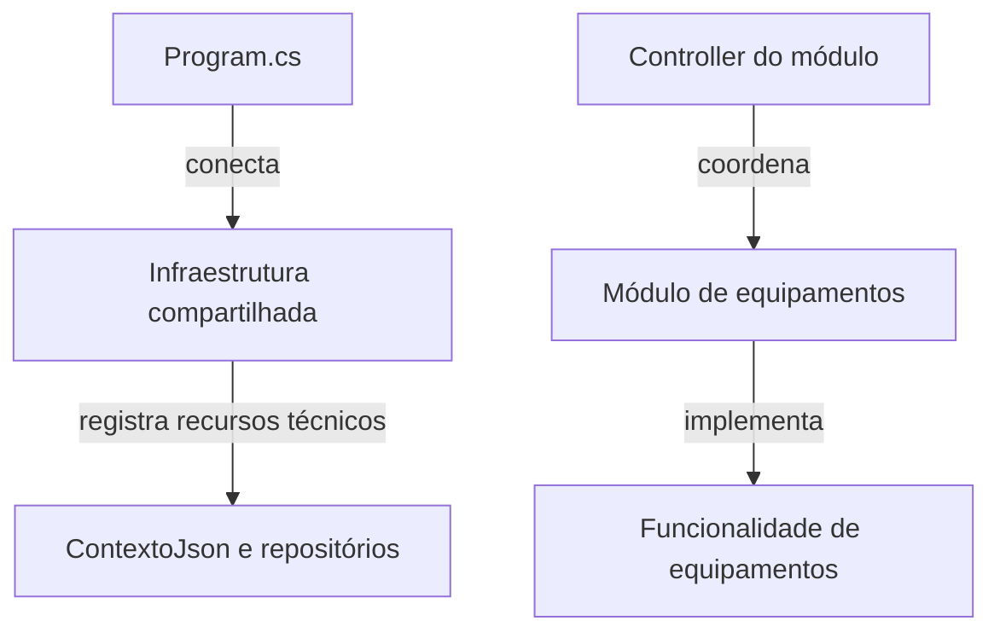

O Controller não deve criar o contexto e o repositório manualmente.

Essa regra mantém a aplicação coerente com o conteúdo da Semana 24 sobre injeção de dependência.

## Exemplo de um módulo de equipamentos

Suponha que a aplicação de gestão de equipamentos vá receber uma funcionalidade de equipamentos.

Uma organização possível é:

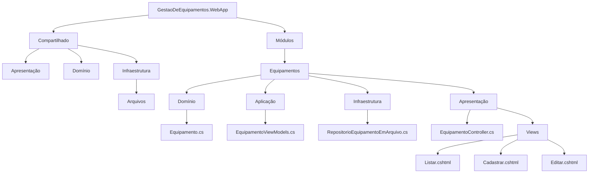

Essa é uma possibilidade, não uma regra obrigatória.

Também seria possível manter os arquivos diretamente na pasta do módulo:

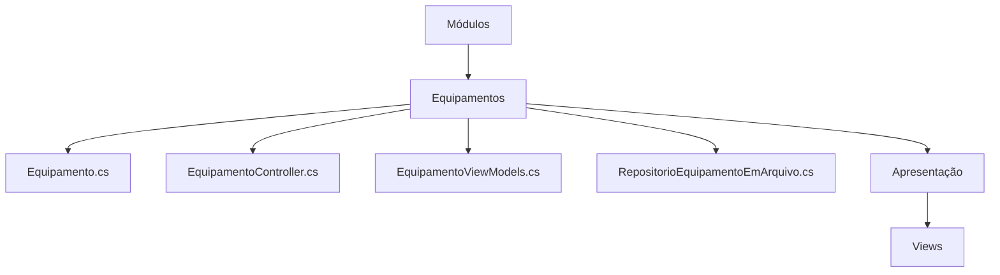

Para uma aplicação no início do desenvolvimento, a segunda estrutura pode ser mais simples.

O importante é que os arquivos de equipamentos não sejam espalhados sem necessidade por pastas globais.

## Uma entidade do módulo

A entidade `Equipamento` pertence ao domínio do módulo de equipamentos.

Ela pode herdar de uma classe base compartilhada:

```csharp
using GestaoDeEquipamentos.WebApp.Compartilhado.Dominio;

namespace GestaoDeEquipamentos.WebApp.Modulos.Equipamentos;

public class Equipamento : EntidadeBase
{
    public string Nome { get; set; } = string.Empty;

    public string NumeroPatrimonio { get; set; } = string.Empty;

    public override void Atualizar(EntidadeBase entidadeAtualizada)
    {
        Equipamento equipamento = (Equipamento)entidadeAtualizada;

        Nome = equipamento.Nome;
        NumeroPatrimonio = equipamento.NumeroPatrimonio;
    }
}
```

O módulo conhece a classe compartilhada `EntidadeBase`.

Mas o código compartilhado não deve conhecer `Equipamento`.

Essa direção evita que o código comum fique dependente de cada funcionalidade concreta.

## ViewModel do módulo

As ViewModels também pertencem à funcionalidade que utiliza seus dados.

Uma ViewModel de cadastro pode ser:

```csharp
using System.ComponentModel.DataAnnotations;

namespace GestaoDeEquipamentos.WebApp.Modulos.Equipamentos;

public record CadastrarEquipamentoViewModel(
    [Required(ErrorMessage = "O nome é obrigatório.")]
    string Nome,

    [Required(ErrorMessage = "O número de patrimônio é obrigatório.")]
    string NumeroPatrimonio
);
```

Essa ViewModel não deve ficar em uma pasta global de ViewModels se ela for utilizada apenas pelo módulo de equipamentos.

Mantê-la próxima ao módulo ajuda a identificar a tela à qual ela pertence.

As regras aprendidas na Semana 25 continuam valendo.

O módulo utiliza `DataAnnotations` e o Controller consulta `ModelState`.

## Controller do módulo

O Controller pode receber o repositório por injeção de dependência:

```csharp
using Microsoft.AspNetCore.Mvc;

namespace GestaoDeEquipamentos.WebApp.Modulos.Equipamentos;

public sealed class EquipamentoController : Controller
{
    private readonly RepositorioEquipamentoEmArquivo repositorio;

    public EquipamentoController(
        RepositorioEquipamentoEmArquivo repositorio
    )
    {
        this.repositorio = repositorio;
    }

    [HttpGet]
    public ActionResult Listar()
    {
        List<Equipamento> equipamentos = repositorio.SelecionarTodos();

        return View(equipamentos);
    }

    [HttpGet]
    public ActionResult Cadastrar()
    {
        return View();
    }

    [HttpPost]
    public ActionResult Cadastrar(
        CadastrarEquipamentoViewModel viewModel
    )
    {
        if (!ModelState.IsValid)
            return View(viewModel);

        Equipamento equipamento = new Equipamento
        {
            Nome = viewModel.Nome,
            NumeroPatrimonio = viewModel.NumeroPatrimonio
        };

        repositorio.Cadastrar(equipamento);

        return RedirectToAction(nameof(Listar));
    }
}
```

O Controller está dentro do módulo de equipamentos.

Ele não precisa conhecer Controllers de fabricantes ou de chamados.

Cada funcionalidade concentra suas próprias Actions.

## Registrando o repositório

Depois de criar o repositório, ele precisa ser registrado no container de dependência.

Uma configuração específica da infraestrutura poderia conter:

```csharp
public static class InjecaoDeDependencia
{
    public static void AdicionarCamadaDeInfraestrutura(
        this IServiceCollection services
    )
    {
        services.AddScoped(_ =>
        {
            ContextoJson contexto = new ContextoJson();

            contexto.Carregar();

            return contexto;
        });

        services.AddScoped<RepositorioEquipamentoEmArquivo>();
    }
}
```

O Controller declara que precisa de `RepositorioEquipamentoEmArquivo`.

O container encontra o registro e monta a cadeia de dependências.

Podemos visualizar o processo:

```mermaid
flowchart TB
    A[ASP.NET precisa criar EquipamentoController]
    A --> B[Controller pede RepositorioEquipamentoEmArquivo]
    B --> C[Container cria o repositório]
    C --> D[Repositório pede ContextoJson]
    D --> E[Container cria e carrega o contexto]
```

Esse fluxo é o mesmo princípio estudado anteriormente, agora aplicado dentro de uma estrutura modular.

## Limites de um módulo

Um módulo pode utilizar código compartilhado.

Mas isso não significa que ele possa acessar qualquer classe de qualquer outro módulo.

Considere estes módulos:

```mermaid
flowchart TB
    A[Módulos]
    A --> B[Equipamentos]
    A --> C[Fabricantes]
    A --> D[Chamados]
```

Um chamado pode precisar estar relacionado a um equipamento.

Essa relação deve ser definida de maneira clara.

O módulo de chamados pode receber o `Id` do equipamento ou utilizar um contrato próprio.

O que deve ser evitado é acessar diretamente todos os detalhes internos do módulo de equipamentos.

Podemos representar uma regra de dependência assim:

```mermaid
flowchart TB
    S[Compartilhado]
    E[Módulo de equipamentos] --> S
    R[Módulo de fabricantes] --> S
    M[Módulo de chamados] --> S
    M -. relação definida .-> E
```

Quanto mais um módulo conhece os detalhes internos de outro, maior fica o acoplamento.

## O que deve ficar em Compartilhado?

Antes de colocar uma classe em `Compartilhado`, faça algumas perguntas:

- mais de um módulo precisa utilizar essa classe?
- ela possui uma responsabilidade realmente comum?
- ela depende de alguma funcionalidade específica?
- a mudança nessa classe afetará vários módulos?

Alguns exemplos que podem ser compartilhados:

- `EntidadeBase`;
- `ContextoJson`;
- classes de persistência em arquivo;
- configurações gerais do MVC;
- layout e componentes visuais comuns.

Alguns exemplos que normalmente devem permanecer no módulo:

- `Equipamento`;
- `Fabricante`;
- `ChamadoController`;
- `CadastrarEquipamentoViewModel`;
- `RepositorioChamadoEmArquivo`.

O fato de uma classe ser importante não significa que ela seja compartilhada.

Ela deve ser compartilhada quando sua responsabilidade for comum a mais de uma parte do sistema.

## Benefícios do monólito modular

Organizar uma aplicação dessa forma pode trazer benefícios como:

- localização mais rápida dos arquivos;
- funcionalidades mais fáceis de entender;
- menor mistura entre assuntos diferentes;
- Controllers mais fáceis de encontrar;
- mudanças mais concentradas;
- possibilidade de desenvolver módulos com mais independência;
- publicação simples de uma única aplicação.

### Localização mais rápida

Ao receber uma tarefa sobre equipamentos, podemos começar pela pasta:

```mermaid
flowchart TB
    A[Modulos/Equipamentos]
```

Não precisamos procurar primeiro em todas as pastas globais do projeto.

### Alterações mais concentradas

Uma mudança no cadastro de equipamentos tende a envolver arquivos do próprio módulo:

```mermaid
flowchart TB
    A[Modulos/Equipamentos]
    A --> B[Equipamento.cs]
    A --> C[EquipamentoController.cs]
    A --> D[EquipamentoViewModels.cs]
    A --> E[RepositorioEquipamentoEmArquivo.cs]
```

Isso não elimina todas as dependências.

Mas torna mais visível o conjunto de arquivos que pode ser afetado.

### Publicação simples

Mesmo com vários módulos, o sistema continua podendo ser publicado como uma única aplicação ASP.NET.

Não precisamos configurar uma implantação diferente para cada pasta.

Essa é uma das principais diferenças em relação a dividir o sistema em vários microserviços.

## Cuidados com a organização modular

O monólito modular também possui riscos.

Criar pastas com nomes de módulos não garante que os limites estejam corretos.

Alguns cuidados são importantes.

### Não crie módulos pequenos demais

Uma classe isolada não precisa ser transformada em um módulo.

O módulo deve representar uma funcionalidade ou um conjunto de regras relacionadas.

### Não crie uma pasta compartilhada para tudo

Se cada classe for colocada em `Compartilhado`, os módulos continuarão acoplados por meio dessa pasta.

### Não duplique regras sem necessidade

Se duas funcionalidades utilizam exatamente uma regra comum, podemos avaliar se existe um componente compartilhado.

Mas a reutilização deve fazer sentido para o domínio.

### Não confunda pasta com limite real

Uma classe de um módulo ainda pode acessar diretamente todas as classes de outro módulo.

Nesse caso, a pasta está separada, mas o acoplamento continua existindo.

### Não altere a convenção a cada funcionalidade

Se um módulo coloca Views dentro da pasta e outro utiliza uma pasta global sem uma decisão clara, a localização do código fica imprevisível.

Escolha uma convenção para o projeto e documente exceções quando necessário.

## Antes e depois da organização

Considere uma estrutura inicial com pastas por tipo:

```mermaid
flowchart TB
    A[Controllers]
    A --> A1[EquipamentoController.cs]
    A --> A2[FabricanteController.cs]
    A --> A3[ChamadoController.cs]
    B[Models]
    B --> B1[Equipamento.cs]
    B --> B2[Fabricante.cs]
    B --> B3[Chamado.cs]
    C[ViewModels]
    C --> C1[CadastrarEquipamentoViewModel.cs]
    D[Repositories]
    D --> D1[RepositorioEquipamentoEmArquivo.cs]
    D --> D2[RepositorioFabricanteEmArquivo.cs]
    D --> D3[RepositorioChamadoEmArquivo.cs]
```

Depois de organizar por módulos:

```mermaid
flowchart TB
    A[Módulos]
    A --> B[Equipamentos]
    B --> B1[Equipamento.cs]
    B --> B2[EquipamentoController.cs]
    B --> B3[CadastrarEquipamentoViewModel.cs]
    B --> B4[RepositorioEquipamentoEmArquivo.cs]
    A --> C[Fabricantes]
    C --> C1[Fabricante.cs]
    C --> C2[FabricanteController.cs]
    C --> C3[RepositorioFabricanteEmArquivo.cs]
    A --> D[Chamados]
    D --> D1[Chamado.cs]
    D --> D2[ChamadoController.cs]
    D --> D3[RepositorioChamadoEmArquivo.cs]
```

No primeiro caso, a pergunta principal é:

> qual é o tipo técnico deste arquivo?

No segundo caso, a pergunta principal é:

> qual funcionalidade este arquivo implementa?

Essa troca de perspectiva melhora a navegação no projeto.

## Como evoluir a estrutura da referência

Partindo da versão `v1` de gestão de equipamentos, podemos seguir uma sequência gradual.

### Criar o módulo

Primeiro, criamos uma pasta para a funcionalidade:

```mermaid
flowchart TB
    A[Módulos] --> B[Equipamentos]
```

### Adicionar a entidade

Depois, colocamos a entidade do domínio no módulo:

```mermaid
flowchart TB
    A[Modulos/Equipamentos] --> B[Equipamento.cs]
```

### Adicionar o repositório

Em seguida, criamos o repositório responsável pelo acesso aos dados:

```mermaid
flowchart TB
    A[Modulos/Equipamentos]
    A --> B[Equipamento.cs]
    A --> C[RepositorioEquipamentoEmArquivo.cs]
```

### Adicionar o Controller e as ViewModels

Os elementos da apresentação ficam próximos da funcionalidade:

```mermaid
flowchart TB
    A[Modulos/Equipamentos]
    A --> B[Equipamento.cs]
    A --> C[EquipamentoController.cs]
    A --> D[EquipamentoViewModels.cs]
    A --> E[RepositorioEquipamentoEmArquivo.cs]
```

### Adicionar as Views

Se o projeto utilizar Views dentro do módulo, podemos criar:

```mermaid
flowchart TB
    A[Modulos/Equipamentos]
    A --> B[Apresentação]
    B --> C[Views]
    C --> C1[Listar.cshtml]
    C --> C2[Cadastrar.cshtml]
    C --> C3[Editar.cshtml]
```

### Registrar as dependências

Por fim, registramos o repositório na configuração de infraestrutura.

O módulo fica pronto para ser utilizado pelo MVC.

## Fluxo de uma requisição modular

O fluxo de cadastro de um equipamento pode ser representado assim:

```mermaid
flowchart TB
    A[Usuário acessa a tela de cadastro]
    A --> B[EquipamentoController exibe a View]
    B --> C[Usuário envia o formulário]
    C --> D[Controller recebe CadastrarEquipamentoViewModel]
    D --> E[ModelState executa as validações]
    E -->|inválido| F[Retorna a View com os erros]
    E -->|válido| G[Cria Equipamento]
    G --> H[RepositorioEquipamentoEmArquivo]
    H --> I[ContextoJson]
```

O fluxo continua sendo o fluxo conhecido do ASP.NET MVC.

A modularização altera principalmente a localização e os limites do código.

Ela não substitui Controllers, ViewModels, validação ou injeção de dependência.

## Checklist de um módulo

Antes de considerar um módulo organizado, verifique se:

- o nome representa uma funcionalidade do negócio;
- as entidades específicas estão dentro do módulo;
- os Controllers específicos estão dentro do módulo;
- as ViewModels específicas estão próximas das telas que utilizam seus dados;
- os repositórios específicos estão próximos do módulo;
- as Views seguem a convenção escolhida pelo projeto;
- dependências compartilhadas possuem responsabilidade clara;
- o módulo não conhece detalhes desnecessários de outros módulos;
- os serviços necessários estão registrados no container;
- o `Program.cs` continua apenas conectando as configurações principais.

## Checklist da aplicação

Também podemos verificar a aplicação como um todo:

- existe um ponto de entrada claro;
- a infraestrutura está separada da apresentação;
- o código compartilhado não contém regras específicas de todos os módulos;
- a localização das Views está configurada de forma consistente;
- cada funcionalidade possui um lugar previsível;
- as dependências entre módulos são justificadas;
- a aplicação continua podendo ser executada e publicada como uma unidade;
- a organização ajuda a localizar o código em vez de apenas criar mais pastas.

## Conclusão

Um monólito é uma aplicação publicada e executada como uma unidade.

Ele não precisa ser desorganizado.

Um monólito modular separa internamente as funcionalidades em módulos relacionados ao negócio.

Cada módulo pode reunir:

- entidades;
- Controllers;
- ViewModels;
- repositórios;
- Views;
- regras específicas da funcionalidade.

O projeto de gestão de equipamentos, na versão `v1`, apresenta uma base com as áreas:

```mermaid
flowchart TB
    A[Compartilhado]
    A --> B[Apresentação]
    A --> C[Domínio]
    A --> D[Infraestrutura]
```

Também prepara a localização de Views dentro de futuros módulos.

Podemos resumir a ideia principal assim:

```mermaid
flowchart TB
    A[Monólito]
    A --> A1[Uma unidade de execução e publicação]
    B[Monólito modular]
    B --> B1[Uma unidade de execução e publicação]
    B1 --> B2[Módulos de negócio]
    C[Microserviços]
    C --> C1[Várias aplicações independentes]
```

A modularização permite começar com uma implantação simples e, ao mesmo tempo, preparar o código para crescer com mais organização.

Para consultar a implementação inicial, veja o repositório [`gestao-de-equipamentos-webapp-2026`, versão `v1`](https://github.com/academiadoprogramador-backend/gestao-de-equipamentos-webapp-2026/tree/v1).
