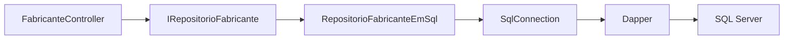
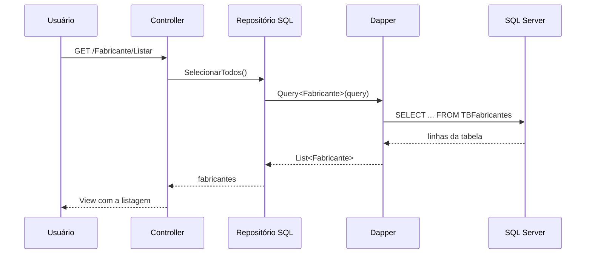
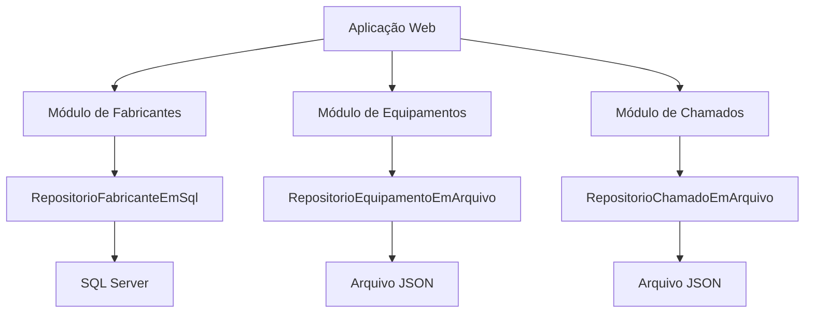

## Integração com SQL Server usando Dapper

Na aula anterior, preparamos um SQL Server local utilizando Docker.

Também configuramos a aplicação para conhecer a string de conexão:

```text
Aplicação ASP.NET
        |
        | localhost:1433
        v
SQL Server executando no Docker
```

Agora vamos fazer a aplicação realmente utilizar esse banco de dados.

Para isso, usaremos o **Dapper**.

O exemplo desta aula utiliza o projeto [`gestao-de-equipamentos-webapp-2026`, versão `v4`](https://github.com/academiadoprogramador-backend/gestao-de-equipamentos-webapp-2026/tree/v4).

Na versão utilizada como referência:

- o módulo de Fabricantes utiliza o SQL Server;
- os módulos de Equipamentos e Chamados continuam utilizando arquivos JSON;
- o `RepositorioFabricanteEmSql` concentra os comandos SQL;
- o Controller continua dependendo da interface do repositório.

Essa migração parcial é intencional.

Ela permite trocar a forma de persistência de uma funcionalidade sem alterar a responsabilidade do Controller.

Ao final da aula, teremos o seguinte fluxo:



## O problema de utilizar apenas arquivos JSON

Nas aulas anteriores, os dados eram armazenados em arquivos JSON.

Essa solução é útil para aprender a persistência e para executar uma aplicação pequena.

Porém, conforme a aplicação cresce, surgem algumas limitações:

- todo o arquivo precisa ser carregado para algumas operações;
- os dados precisam ser convertidos entre objetos e JSON;
- várias requisições podem tentar alterar o mesmo arquivo;
- consultas mais específicas ficam trabalhosas;
- o banco não oferece índices e restrições para esses dados.

Um banco de dados relacional foi criado para armazenar informações relacionadas em tabelas.

O SQL Server pode:

- armazenar os registros em tabelas;
- localizar dados com consultas SQL;
- controlar alterações por meio de comandos;
- garantir identificadores únicos;
- aplicar restrições aos dados.

O problema passa a ser outro:

> como executar comandos SQL a partir de uma aplicação C#?

## O que é o Dapper?

O Dapper é uma biblioteca para acesso a dados em aplicações .NET.

Ele é conhecido como um **micro-ORM**.

ORM significa **Object-Relational Mapper**, ou mapeador objeto-relacional.

Um mapeador objeto-relacional ajuda a converter:

- linhas de uma tabela em objetos C#;
- propriedades de objetos em parâmetros de comandos SQL;
- resultados de consultas em coleções de objetos.

O Dapper faz esse mapeamento sem esconder o SQL que será executado.

Por exemplo, o código continua apresentando a consulta:

```csharp
const string query = "SELECT Id, Nome, Email, Telefone FROM dbo.TBFabricantes";
```

O Dapper executa essa consulta e pode transformar cada linha em um objeto `Fabricante`.

Podemos resumir a responsabilidade de cada biblioteca assim:

| Biblioteca | Responsabilidade |
| --- | --- |
| `Microsoft.Data.SqlClient` | conectar a aplicação ao SQL Server |
| `Dapper` | executar comandos e mapear resultados para objetos |
| SQL Server | armazenar e consultar os dados |

> O Dapper não é o banco de dados. Ele é uma biblioteca que facilita a comunicação entre o código C# e o banco.

## Dapper e um ORM completo

Um ORM completo normalmente oferece recursos como:

- geração ou atualização de estruturas do banco;
- acompanhamento automático das alterações nos objetos;
- construção de consultas por meio de métodos ou expressões;
- gerenciamento de relacionamentos entre entidades.

O Dapper é mais simples.

Ele deixa o desenvolvedor escrever o SQL e oferece métodos para executar esse SQL.

Essa abordagem possui algumas consequências:

- temos mais controle sobre o comando enviado ao banco;
- precisamos conhecer SQL;
- precisamos escolher quais colunas serão consultadas;
- precisamos cuidar das alterações na estrutura do banco.

Para uma aula inicial de integração com SQL Server, essa transparência é importante.

O aluno consegue visualizar o caminho completo entre o método C# e o comando SQL.

## Preparando o banco de dados

Antes de executar a aplicação, o container do SQL Server deve estar em execução.

Na Semana 27, utilizamos o container:

```text
sqlserver-local
```

Verifique o status:

```bash
docker ps
```

O container precisa apresentar um status semelhante a `Up`.

Também é necessário aguardar a mensagem que indica que o SQL Server está pronto:

```text
SQL Server is now ready for client connections.
```

### Criando o banco

O SQL Server pode executar comandos por meio do utilitário `sqlcmd` dentro do container.

Execute o comando a seguir para criar o banco caso ele ainda não exista:

```bash
docker exec -it sqlserver-local \
  /opt/mssql-tools18/bin/sqlcmd \
  -S localhost \
  -U sa \
  -P 'Academia@2026!' \
  -C \
  -Q "IF DB_ID(N'GestaoDeEquipamentosDB') IS NULL EXEC(N'CREATE DATABASE GestaoDeEquipamentosDB');"
```

O trecho `IF DB_ID(...) IS NULL` evita tentar criar novamente um banco que já existe.

> **Atenção:** a senha utilizada é uma credencial de exemplo para desenvolvimento local. Não utilize esse valor em produção.

### Criando a tabela de fabricantes

Agora criaremos a tabela utilizada pelo repositório do módulo de Fabricantes.

```bash
docker exec -it sqlserver-local \
  /opt/mssql-tools18/bin/sqlcmd \
  -S localhost \
  -U sa \
  -P 'Academia@2026!' \
  -C \
  -d GestaoDeEquipamentosDB \
  -Q "IF OBJECT_ID(N'dbo.TBFabricantes', N'U') IS NULL CREATE TABLE dbo.TBFabricantes (Id INT IDENTITY(1,1) NOT NULL PRIMARY KEY, Nome NVARCHAR(100) NOT NULL, Email NVARCHAR(200) NOT NULL, Telefone NVARCHAR(30) NOT NULL);"
```

A tabela possui as mesmas informações da classe `Fabricante`:

| Coluna | Tipo | Finalidade |
| --- | --- | --- |
| `Id` | `INT IDENTITY` | identificador gerado pelo banco |
| `Nome` | `NVARCHAR(100)` | nome do fabricante |
| `Email` | `NVARCHAR(200)` | email do fabricante |
| `Telefone` | `NVARCHAR(30)` | telefone do fabricante |

O `IDENTITY(1,1)` faz o SQL Server gerar os identificadores automaticamente.

A aplicação não precisa escolher o próximo `Id`.

O `PRIMARY KEY` garante que o identificador seja único.

## Instalando os pacotes

O projeto precisa de dois pacotes NuGet:

- `Microsoft.Data.SqlClient`, para criar a conexão com o SQL Server;
- `Dapper`, para executar comandos e mapear resultados.

Na versão `v4`, o arquivo `GestaoDeEquipamentos.WebApp.csproj` possui referências semelhantes a estas:

```xml
<ItemGroup>
  <PackageReference Include="Dapper" Version="2.1.79" />
  <PackageReference Include="Microsoft.Data.SqlClient" Version="7.0.2" />
</ItemGroup>
```

Também podemos adicionar os pacotes pelo terminal:

```bash
dotnet add GestaoDeEquipamentos.WebApp package Dapper --version 2.1.79
dotnet add GestaoDeEquipamentos.WebApp package Microsoft.Data.SqlClient --version 7.0.2
```

Depois, restaure as dependências:

```bash
dotnet restore
```

O pacote `Dapper` disponibiliza métodos como:

- `Query<T>`, para consultar vários registros;
- `QuerySingle<T>`, para consultar exatamente um registro;
- `QuerySingleOrDefault<T>`, para consultar zero ou um registro;
- `Execute`, para executar comandos que alteram dados.

## Configurando a string de conexão

A aplicação precisa saber onde está o SQL Server e como realizar a autenticação.

No arquivo `appsettings.Development.json`, configure:

```json
{
  "ConnectionStrings": {
    "SqlServerDocker": "Server=localhost,1433;Database=GestaoDeEquipamentosDB;User Id=sa;Password=Academia@2026!;TrustServerCertificate=True;MultipleActiveResultSets=True"
  }
}
```

Cada parte da string possui uma função:

| Parte | Função |
| --- | --- |
| `Server=localhost,1433` | servidor e porta publicados pelo Docker |
| `Database=GestaoDeEquipamentosDB` | banco que será utilizado |
| `User Id=sa` | usuário do SQL Server |
| `Password=...` | senha do usuário |
| `TrustServerCertificate=True` | aceita o certificado local de desenvolvimento |
| `MultipleActiveResultSets=True` | permite mais de um conjunto de resultados na conexão |

O nome `SqlServerDocker` também precisa ser utilizado no código.

```csharp
string connectionString = configuration.GetConnectionString("SqlServerDocker")
    ?? throw new InvalidOperationException(
        "A string de conexão não foi configurada"
    );
```

Se o nome no JSON for `SqlServerDocker` e o nome no código for diferente, a aplicação não encontrará a configuração.

> **Atenção:** não coloque senhas reais em arquivos versionados. Em um ambiente real, utilize secrets, variáveis de ambiente ou outro mecanismo de configuração segura.

## O contrato do repositório

O Controller não precisa conhecer Dapper nem SQL Server.

Ele utiliza a interface do repositório:

```csharp
public interface IRepositorioFabricante
{
    void Cadastrar(Fabricante novoRegistro);
    bool Editar(int idSelecionado, Fabricante entidadeAtualizada);
    bool Excluir(int idSelecionado);
    Fabricante? SelecionarPorId(int idSelecionado);
    List<Fabricante> SelecionarTodos();
}
```

Essa interface descreve as operações que o módulo precisa realizar.

Ela não informa se os dados estão:

- em um arquivo JSON;
- em uma tabela SQL Server;
- em outro tipo de armazenamento.

Por isso, podemos criar uma implementação para SQL Server sem alterar o contrato do módulo.

```text
IRepositorioFabricante
        |
        +-- RepositorioFabricanteEmArquivo
        |
        +-- RepositorioFabricanteEmSql
```

Essa separação também permite que o Controller continue sendo testado sem conhecer detalhes da conexão.

## Criando a conexão com o SQL Server

O `Microsoft.Data.SqlClient` fornece a classe `SqlConnection`.

Ela representa uma conexão com o SQL Server.

```csharp
using Microsoft.Data.SqlClient;

SqlConnection conexao = new SqlConnection(connectionString);
```

Depois de criar a conexão, o Dapper poderá utilizar seus métodos para executar comandos.

Como a conexão utiliza recursos externos, devemos liberá-la quando o método terminar.

```csharp
using SqlConnection conexao = new(connectionString);
```

Esse formato garante que a conexão seja descartada ao final do escopo do método.

O repositório não precisa manter uma conexão aberta permanentemente.

Cada operação abre e libera a conexão conforme necessário.

## Implementando a consulta de todos os fabricantes

Para listar fabricantes, escrevemos uma consulta SQL:

```csharp
const string query =
    """
    SELECT Id, Nome, Email, Telefone
    FROM dbo.TBFabricantes
    ORDER BY Id
    """;
```

Depois, usamos `Query<Fabricante>`:

```csharp
public List<Fabricante> SelecionarTodos()
{
    const string query =
        """
        SELECT Id, Nome, Email, Telefone
        FROM dbo.TBFabricantes
        ORDER BY Id
        """;

    using SqlConnection conexao = new(connectionString);

    return conexao.Query<Fabricante>().ToList();
}
```

O tipo `Fabricante` informa ao Dapper como mapear o resultado.

O mapeamento funciona porque os nomes das colunas correspondem aos nomes das propriedades:

```text
Id       -> Fabricante.Id
Nome     -> Fabricante.Nome
Email    -> Fabricante.Email
Telefone -> Fabricante.Telefone
```

Se o nome de uma coluna for diferente do nome da propriedade, será necessário ajustar a consulta ou realizar um mapeamento específico.

## Consultando um fabricante pelo identificador

Para editar ou excluir um fabricante, primeiro precisamos localizar o registro.

A consulta recebe o identificador como parâmetro:

```csharp
public Fabricante? SelecionarPorId(int idSelecionado)
{
    const string query =
        """
        SELECT Id, Nome, Email, Telefone
        FROM dbo.TBFabricantes
        WHERE Id = @Id
        """;

    using SqlConnection conexao = new(connectionString);

    return conexao.QuerySingleOrDefault<Fabricante>(
        query,
        new { Id = idSelecionado }
    );
}
```

O trecho `@Id` é um parâmetro do SQL.

O objeto anônimo informa o valor desse parâmetro:

```csharp
new { Id = idSelecionado }
```

O método `QuerySingleOrDefault` retorna:

- um `Fabricante`, quando o registro existe;
- `null`, quando nenhum registro possui esse identificador.

## Cadastrando um fabricante

Para cadastrar, usamos o comando `INSERT`.

Como o `Id` é gerado pelo SQL Server, podemos pedir ao banco o identificador criado com `OUTPUT INSERTED.Id`:

```csharp
public void Cadastrar(Fabricante novoRegistro)
{
    const string query =
        """
        INSERT INTO dbo.TBFabricantes (Nome, Email, Telefone)
        OUTPUT INSERTED.Id
        VALUES (@Nome, @Email, @Telefone)
        """;

    using SqlConnection conexao = new(connectionString);

    novoRegistro.Id = conexao.QuerySingle<int>(query, novoRegistro);
}
```

O Dapper procura os valores `Nome`, `Email` e `Telefone` no objeto `novoRegistro`.

O banco gera o `Id`.

Depois, o valor retornado é atribuído ao objeto C#.

```text
Objeto C# sem Id
        |
        | INSERT
        v
SQL Server gera o Id
        |
        | OUTPUT INSERTED.Id
        v
Objeto C# recebe o Id
```

## Editando um fabricante

Para editar, utilizamos o comando `UPDATE`:

```csharp
public bool Editar(int idSelecionado, Fabricante entidadeAtualizada)
{
    const string query =
        """
        UPDATE dbo.TBFabricantes
        SET Nome = @Nome,
            Email = @Email,
            Telefone = @Telefone
        WHERE Id = @Id
        """;

    using SqlConnection conexao = new(connectionString);

    int quantidadeRegistrosAlterados = conexao.Execute(query, new
    {
        Id = idSelecionado,
        entidadeAtualizada.Nome,
        entidadeAtualizada.Email,
        entidadeAtualizada.Telefone
    });

    return quantidadeRegistrosAlterados == 1;
}
```

O método `Execute` retorna a quantidade de registros afetados.

Nesse caso, esperamos que exatamente um registro seja alterado.

Se o identificador não existir, o resultado será zero.

O Controller pode utilizar esse resultado para retornar `NotFound()`.

## Excluindo um fabricante

A exclusão utiliza um comando `DELETE`:

```csharp
public bool Excluir(int idSelecionado)
{
    const string query =
        "DELETE FROM dbo.TBFabricantes WHERE Id = @Id";

    using SqlConnection conexao = new(connectionString);

    int quantidadeRegistrosExcluidos = conexao.Execute(
        query,
        new { Id = idSelecionado }
    );

    return quantidadeRegistrosExcluidos == 1;
}
```

Novamente, o valor retornado pelo `Execute` informa se o registro existia.

O parâmetro `@Id` evita construir o comando concatenando texto recebido da requisição.

## Por que utilizar parâmetros?

Considere uma consulta construída com concatenação:

```csharp
string query = "SELECT * FROM TBFabricantes WHERE Id = " + idSelecionado;
```

Esse formato mistura o comando SQL com valores recebidos pela aplicação.

Além de dificultar a leitura, ele pode permitir ataques de **SQL Injection** quando valores de texto são concatenados diretamente.

Com parâmetros, o comando e os valores são enviados separadamente:

```csharp
const string query =
    "SELECT * FROM TBFabricantes WHERE Id = @Id";

Fabricante? fabricante = conexao.QuerySingleOrDefault<Fabricante>(
    query,
    new { Id = idSelecionado }
);
```

Prefira sempre os parâmetros do Dapper:

- `@Id` no SQL;
- `new { Id = idSelecionado }` no segundo argumento;
- nenhuma concatenação de valores recebidos do usuário.

> **Atenção:** parametrizar consultas é uma prática de segurança. Não substitua parâmetros por concatenação para deixar o código aparentemente mais simples.

## Criando o repositório completo

Juntando as operações, o repositório da versão de referência fica assim:

```csharp
using Dapper;
using Microsoft.Data.SqlClient;
using GestaoDeEquipamentos.WebApp.Modulos.Fabricantes.Dominio;

namespace GestaoDeEquipamentos.WebApp.Modulos.Fabricantes.Infraestrutura;

public sealed class RepositorioFabricanteEmSql : IRepositorioFabricante
{
    private readonly string connectionString;

    public RepositorioFabricanteEmSql(string connectionString)
    {
        this.connectionString = connectionString;
    }

    public void Cadastrar(Fabricante novoRegistro)
    {
        const string query =
            """
            INSERT INTO dbo.TBFabricantes (Nome, Email, Telefone)
            OUTPUT INSERTED.Id
            VALUES (@Nome, @Email, @Telefone)
            """;

        using SqlConnection conexao = new(connectionString);

        novoRegistro.Id = conexao.QuerySingle<int>(query, novoRegistro);
    }

    public bool Editar(int idSelecionado, Fabricante entidadeAtualizada)
    {
        const string query =
            """
            UPDATE dbo.TBFabricantes
            SET Nome = @Nome,
                Email = @Email,
                Telefone = @Telefone
            WHERE Id = @Id
            """;

        using SqlConnection conexao = new(connectionString);

        int quantidadeRegistrosAlterados = conexao.Execute(query, new
        {
            Id = idSelecionado,
            entidadeAtualizada.Nome,
            entidadeAtualizada.Email,
            entidadeAtualizada.Telefone
        });

        return quantidadeRegistrosAlterados == 1;
    }

    public bool Excluir(int idSelecionado)
    {
        const string query = "DELETE FROM dbo.TBFabricantes WHERE Id = @Id";

        using SqlConnection conexao = new(connectionString);

        int quantidadeRegistrosExcluidos = conexao.Execute(query, new { Id = idSelecionado });

        return quantidadeRegistrosExcluidos == 1;
    }

    public Fabricante? SelecionarPorId(int idSelecionado)
    {
        const string query =
            """
            SELECT Id, Nome, Email, Telefone
            FROM dbo.TBFabricantes
            WHERE Id = @Id
            """;

        using SqlConnection conexao = new(connectionString);

        return conexao.QuerySingleOrDefault<Fabricante>(query, new { Id = idSelecionado });
    }

    public List<Fabricante> SelecionarTodos()
    {
        const string query =
            """
            SELECT Id, Nome, Email, Telefone
            FROM dbo.TBFabricantes
            ORDER BY Id
            """;

        using SqlConnection conexao = new(connectionString);

        return conexao.Query<Fabricante>(query).ToList();
    }
}
```

Observe que o repositório possui apenas responsabilidades relacionadas ao armazenamento:

- escrever SQL;
- abrir a conexão;
- enviar parâmetros;
- converter resultados em objetos;
- informar a quantidade de registros alterados.

Ele não deve:

- receber requisições HTTP;
- retornar Views;
- adicionar mensagens na tela;
- decidir como o formulário será apresentado.

## Registrando o repositório no container

O repositório precisa ser registrado no container de injeção de dependência.

Na configuração de infraestrutura, primeiro recuperamos a string de conexão:

```csharp
string connectionString = configuration.GetConnectionString("SqlServerDocker")
    ?? throw new InvalidOperationException(
        "A string de conexão \"SqlServerDocker\" não foi configurada"
    );
```

Depois, registramos a implementação para a interface:

```csharp
services.AddScoped<IRepositorioFabricante>(_ =>
{
    return new RepositorioFabricanteEmSql(connectionString);
});
```

Quando o ASP.NET precisar criar um `FabricanteController`, ele encontrará a dependência:

```text
FabricanteController pede IRepositorioFabricante
        |
        v
Container encontra RepositorioFabricanteEmSql
        |
        v
Repositório recebe a string de conexão
        |
        v
Controller recebe o repositório pronto
```

O Controller continua recebendo a interface:

```csharp
public sealed class FabricanteController : Controller
{
    private readonly IRepositorioFabricante repositorio;

    public FabricanteController(IRepositorioFabricante repositorio)
    {
        this.repositorio = repositorio;
    }
}
```

O Controller não precisa ser alterado para conhecer Dapper.

Essa é uma consequência importante da separação entre contrato e implementação.

## O que acontece durante uma requisição?

Quando o usuário acessa a listagem de fabricantes, o fluxo é:



No cadastro, o caminho é semelhante:

1. O usuário envia o formulário.
2. O Controller valida a ViewModel.
3. O Controller cria um `Fabricante`.
4. O Controller chama `repositorio.Cadastrar(fabricante)`.
5. O repositório executa o `INSERT`.
6. O SQL Server gera o identificador.
7. O Controller redireciona para a listagem.

O SQL Server não é acessado diretamente pela View.

A View também não conhece o Dapper.

## Executando e testando a aplicação

Depois de criar o banco, a tabela e configurar a conexão, execute:

```bash
dotnet run --project GestaoDeEquipamentos.WebApp
```

Abra a tela de fabricantes e teste as operações:

1. Acesse a listagem de fabricantes.
2. Cadastre um fabricante.
3. Confirme se ele aparece na lista.
4. Edite o nome ou outro campo.
5. Confirme se o valor foi alterado.
6. Exclua o fabricante.
7. Confirme se ele deixou de aparecer.

Também podemos consultar os registros diretamente no SQL Server:

```bash
docker exec -it sqlserver-local \
  /opt/mssql-tools18/bin/sqlcmd \
  -S localhost \
  -U sa \
  -P 'Academia@2026!' \
  -C \
  -d GestaoDeEquipamentosDB \
  -Q "SELECT Id, Nome, Email, Telefone FROM dbo.TBFabricantes ORDER BY Id;"
```

Se o cadastro aparecer nesse resultado, a aplicação persistiu o registro no SQL Server.

## SQL Server e JSON ao mesmo tempo

Na versão `v4`, a aplicação utiliza duas formas de persistência:



Isso é possível porque cada módulo possui seu próprio repositório.

O Controller de fabricantes utiliza `IRepositorioFabricante`.

O container entrega a implementação SQL.

Os outros Controllers continuam recebendo seus repositórios em arquivo.

Essa estratégia permite migrar a aplicação de forma gradual.

Não é necessário alterar todos os módulos ao mesmo tempo.

## Problemas comuns

### O banco não existe

Se a aplicação não encontrar `GestaoDeEquipamentosDB`, execute novamente o comando de criação do banco.

Confira o nome utilizado em:

- `appsettings.Development.json`;
- comando de criação;
- nome da tabela;
- consultas do repositório.

### A tabela não existe

A mensagem `Invalid object name 'dbo.TBFabricantes'` indica que a tabela ainda não foi criada no banco utilizado pela conexão.

Execute o comando de criação da tabela.

Também confirme se o banco da conexão é `GestaoDeEquipamentosDB`.

### A aplicação não consegue conectar

Verifique:

- se o container `sqlserver-local` está em execução;
- se o SQL Server já informou que está pronto;
- se a porta da string é `1433`;
- se a senha é igual à senha do container;
- se `TrustServerCertificate=True` está configurado para o ambiente local.

### Falha de login

A mensagem de falha de login normalmente indica usuário ou senha incorretos.

Compare os valores do container com a string de conexão:

```text
Container: sa / Academia@2026!
Aplicação: sa / Academia@2026!
```

### Nenhum registro é retornado

Confira:

- se a aplicação está utilizando `SqlServerDocker`;
- se o banco consultado é o correto;
- se os registros foram cadastrados nessa tabela;
- se o nome das colunas corresponde às propriedades do objeto.

### A porta 1433 está ocupada

Se o container foi criado utilizando outra porta, por exemplo `11433`, a string precisa utilizar essa porta:

```text
Server=localhost,11433
```

O primeiro número representa a porta no computador.

## Checklist

Antes de considerar a integração concluída, verifique se:

- o container SQL Server está em execução;
- o banco `GestaoDeEquipamentosDB` existe;
- a tabela `dbo.TBFabricantes` existe;
- o pacote `Dapper` foi instalado;
- o pacote `Microsoft.Data.SqlClient` foi instalado;
- a conexão possui o nome `SqlServerDocker`;
- a conexão aponta para `localhost,1433`;
- o repositório utiliza `SqlConnection`;
- as consultas utilizam parâmetros;
- o repositório está registrado para `IRepositorioFabricante`;
- o Controller continua dependendo da interface;
- o cadastro, a edição, a consulta e a exclusão funcionam.

## Conclusão

O Dapper permite integrar uma aplicação ASP.NET ao SQL Server sem esconder os comandos SQL.

Nesta aula:

- criamos o banco `GestaoDeEquipamentosDB`;
- criamos a tabela `TBFabricantes`;
- conhecemos a função do `Microsoft.Data.SqlClient`;
- instalamos o Dapper;
- configuramos a string de conexão;
- implementamos consultas parametrizadas;
- cadastramos, editamos e excluímos registros;
- registramos o repositório no container;
- mantivemos o Controller dependente da interface;
- migramos apenas o módulo de Fabricantes para o SQL Server.

O fluxo principal pode ser resumido assim:

```text
Controller
    utiliza a interface do repositório

RepositorioFabricanteEmSql
    cria uma SqlConnection

Dapper
    executa o SQL e mapeia os resultados

SQL Server
    armazena os dados na tabela TBFabricantes
```

Para consultar a implementação completa, veja o repositório [`gestao-de-equipamentos-webapp-2026`, versão `v4`](https://github.com/academiadoprogramador-backend/gestao-de-equipamentos-webapp-2026/tree/v4).
