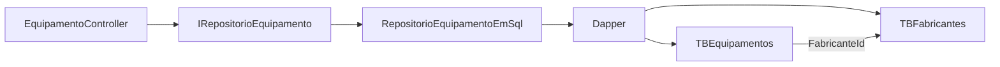
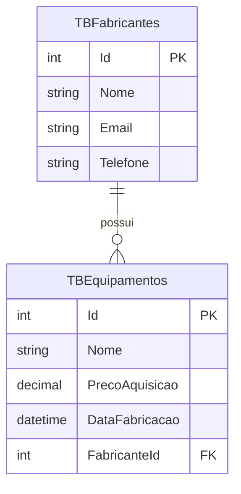
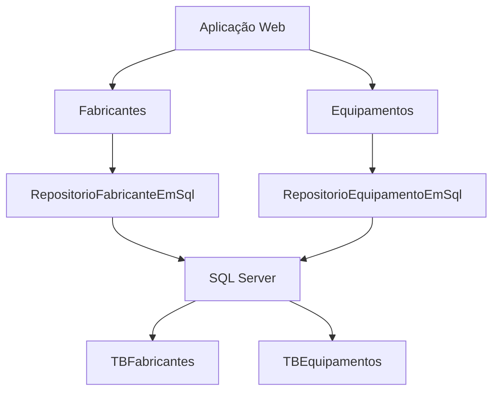
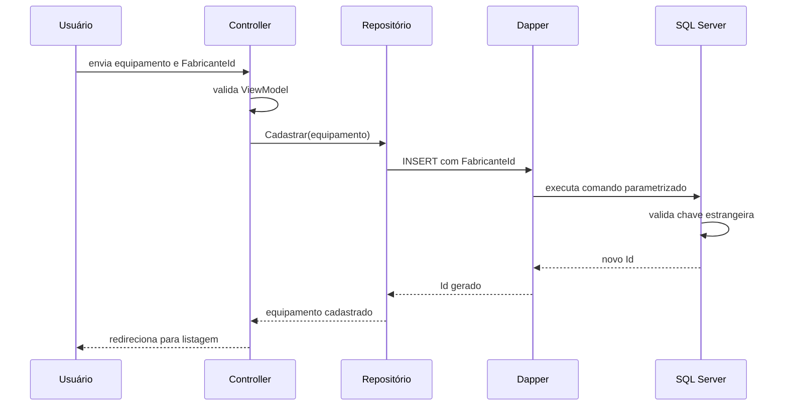

## Chave Estrangeira e JOIN no SQL Server

Na aula anterior, utilizamos o Dapper para persistir fabricantes no SQL Server.

Agora vamos persistir também os equipamentos.

Um equipamento não existe isoladamente no sistema.

Ele pertence a um fabricante.

Por exemplo:

```text
Fabricante: Dell
    |
    +-- Notebook Latitude
    +-- Monitor UltraSharp
```

Essa relação precisa ser representada em dois lugares:

- no banco de dados, por meio de uma chave estrangeira;
- nos objetos C#, por meio da propriedade `Fabricante`.

O exemplo desta aula utiliza o projeto [`gestao-de-equipamentos-webapp-2026`, versão `v5`](https://github.com/academiadoprogramador-backend/gestao-de-equipamentos-webapp-2026/tree/v5).

Na versão utilizada como referência:

- `TBFabricantes` armazena os fabricantes;
- `TBEquipamentos` armazena os equipamentos;
- `TBEquipamentos.FabricanteId` referencia `TBFabricantes.Id`;
- o `RepositorioEquipamentoEmSql` utiliza `INNER JOIN`;
- o Dapper transforma as colunas das duas tabelas em dois objetos C#.

Ao final, teremos este fluxo:



## O problema de armazenar apenas o nome do fabricante

Uma primeira solução seria guardar o nome do fabricante diretamente na tabela de equipamentos:

```text
TBEquipamentos

Id | Nome             | Fabricante
1  | Notebook         | Dell
2  | Monitor           | Dell
3  | Impressora       | HP
```

Essa solução parece simples.

Porém, ela permite alguns problemas:

- o mesmo fabricante pode ser escrito de formas diferentes;
- uma alteração no nome precisa atualizar vários equipamentos;
- não existe uma garantia de que o texto corresponde a um fabricante cadastrado;
- o banco não sabe que equipamentos e fabricantes possuem uma relação;
- informações do fabricante podem ficar repetidas em várias linhas.

Imagine que um usuário digite `Dell` em um registro e `DELL` em outro.

Para o sistema, os textos podem representar a mesma empresa.

Para o banco, são valores diferentes.

Uma solução melhor é guardar o identificador do fabricante:

```text
TBEquipamentos

Id | Nome             | FabricanteId
1  | Notebook         | 1
2  | Monitor           | 1
3  | Impressora       | 2
```

Nesse formato, o equipamento guarda uma referência ao fabricante.

O nome e os outros dados do fabricante permanecem em `TBFabricantes`.

## Relembrando as tabelas

Antes de criar a relação, precisamos entender o papel de cada tabela.

### Tabela de fabricantes

A tabela `TBFabricantes` possui um registro para cada fabricante:

| Id | Nome | Email | Telefone |
| --- | --- | --- | --- |
| 1 | Dell | contato@dell.com | 1111-1111 |
| 2 | HP | contato@hp.com | 2222-2222 |

O campo `Id` identifica cada registro.

Esse campo é a chave primária da tabela.

### Tabela de equipamentos

A tabela `TBEquipamentos` possui um registro para cada equipamento:

| Id | Nome | PrecoAquisicao | DataFabricacao | FabricanteId |
| --- | --- | --- | --- | --- |
| 1 | Notebook | 3500.00 | 2025-01-10 | 1 |
| 2 | Monitor | 1200.00 | 2025-02-15 | 1 |
| 3 | Impressora | 900.00 | 2025-03-20 | 2 |

O campo `FabricanteId` informa a qual fabricante o equipamento pertence.

Ele não guarda o nome `Dell` ou `HP`.

Guarda o valor da chave primária do fabricante.

## O que é uma chave primária?

Uma **chave primária** é uma coluna, ou conjunto de colunas, usada para identificar um registro de forma única.

Na tabela de fabricantes:

```sql
Id INT IDENTITY(1,1) NOT NULL PRIMARY KEY
```

O `Id` possui duas características importantes:

- não pode ser repetido;
- não pode ser nulo.

Por isso, podemos usar `TBFabricantes.Id` para identificar exatamente um fabricante.

A mesma ideia é utilizada em `TBEquipamentos.Id`.

```text
TBFabricantes.Id
    identifica um fabricante

TBEquipamentos.Id
    identifica um equipamento
```

## O que é uma chave estrangeira?

Uma **chave estrangeira** é uma coluna que guarda o valor de uma chave primária de outra tabela.

Em `TBEquipamentos`, a coluna `FabricanteId` referencia `TBFabricantes.Id`.

Podemos representar essa relação assim:

```text
TBFabricantes
    Id 1: Dell
    Id 2: HP

TBEquipamentos
    FabricanteId 1: pertence à Dell
    FabricanteId 1: pertence à Dell
    FabricanteId 2: pertence à HP
```

> A chave estrangeira não guarda o objeto `Fabricante`. Ela guarda o valor que aponta para o registro do fabricante.

## Criando a relação no banco

A tabela de fabricantes precisa existir antes da tabela de equipamentos.

Isso acontece porque a chave estrangeira de equipamentos aponta para ela.

Utilizaremos esta estrutura:

```sql
CREATE TABLE dbo.TBEquipamentos
(
    Id INT IDENTITY(1,1) NOT NULL PRIMARY KEY,
    Nome NVARCHAR(100) NOT NULL,
    PrecoAquisicao DECIMAL(18, 2) NOT NULL,
    DataFabricacao DATETIME2 NOT NULL,
    FabricanteId INT NOT NULL,
    CONSTRAINT FK_TBEquipamentos_TBFabricantes
        FOREIGN KEY (FabricanteId)
        REFERENCES dbo.TBFabricantes (Id)
);
```

Observe a parte final do comando:

```sql
CONSTRAINT FK_TBEquipamentos_TBFabricantes
    FOREIGN KEY (FabricanteId)
    REFERENCES dbo.TBFabricantes (Id)
```

Ela informa que:

- `FabricanteId` é uma chave estrangeira;
- a coluna pertence à tabela `TBEquipamentos`;
- a referência aponta para `TBFabricantes.Id`.

O nome da constraint é uma identificação para essa regra.

### Criando a tabela pelo Docker

Considerando o container da Semana 27, execute:

```bash
docker exec -it sqlserver-local \
  /opt/mssql-tools18/bin/sqlcmd \
  -S localhost \
  -U sa \
  -P 'Academia@2026!' \
  -C \
  -d GestaoDeEquipamentosDB \
  -Q "IF OBJECT_ID(N'dbo.TBEquipamentos', N'U') IS NULL CREATE TABLE dbo.TBEquipamentos (Id INT IDENTITY(1,1) NOT NULL PRIMARY KEY, Nome NVARCHAR(100) NOT NULL, PrecoAquisicao DECIMAL(18,2) NOT NULL, DataFabricacao DATETIME2 NOT NULL, FabricanteId INT NOT NULL, CONSTRAINT FK_TBEquipamentos_TBFabricantes FOREIGN KEY (FabricanteId) REFERENCES dbo.TBFabricantes (Id));"
```

O comando utiliza `IF OBJECT_ID(...) IS NULL` para criar a tabela apenas quando ela ainda não existe.

Se a tabela de fabricantes ainda não existir, crie-a utilizando o comando apresentado no documento anterior da Semana 28.

## O que a chave estrangeira garante?

A chave estrangeira impede que um equipamento aponte para um fabricante inexistente.

Por exemplo, este comando funciona quando o fabricante de `Id = 1` existe:

```sql
INSERT INTO dbo.TBEquipamentos
    (Nome, PrecoAquisicao, DataFabricacao, FabricanteId)
VALUES
    (N'Notebook', 3500.00, '2025-01-10', 1);
```

Já este comando pode falhar quando não existe fabricante com `Id = 99`:

```sql
INSERT INTO dbo.TBEquipamentos
    (Nome, PrecoAquisicao, DataFabricacao, FabricanteId)
VALUES
    (N'Notebook', 3500.00, '2025-01-10', 99);
```

O banco rejeita a operação porque ela criaria uma referência inválida.

Esse registro sem fabricante correspondente seria chamado de **registro órfão**.

A chave estrangeira ajuda a impedir esse tipo de inconsistência.

## Cardinalidade da relação

No projeto, a relação possui esta cardinalidade:

```text
Um fabricante pode possuir vários equipamentos.

Cada equipamento pertence a um fabricante.
```

Essa é uma relação **um para muitos**:



O lado `TBFabricantes` possui um registro para a empresa.

O lado `TBEquipamentos` pode possuir vários registros com o mesmo `FabricanteId`.

Por isso, podemos encontrar:

```text
FabricanteId = 1 em vários equipamentos
```

Mas cada equipamento possui apenas um `FabricanteId`.

## A relação nos objetos C#

No banco, o equipamento guarda um inteiro:

```csharp
public int FabricanteId { get; set; }
```

Na versão `v5`, o domínio utiliza uma propriedade do tipo `Fabricante`:

```csharp
public sealed class Equipamento : EntidadeBase
{
    public string Nome { get; set; } = string.Empty;
    public decimal PrecoAquisicao { get; set; }
    public DateTime DataFabricacao { get; set; }
    public Fabricante Fabricante { get; set; } = null!;
}
```

Essa diferença é importante:

```text
Banco de dados
    FabricanteId = 1

Objeto C#
    Fabricante = objeto Fabricante com Id 1
```

O banco trabalha com uma referência numérica.

O código C# pode trabalhar com um objeto completo.

O repositório precisa fazer a conversão entre esses dois formatos.

## Por que precisamos do JOIN?

Uma consulta simples em `TBEquipamentos` retorna apenas o identificador do fabricante:

```sql
SELECT Id, Nome, PrecoAquisicao, DataFabricacao, FabricanteId
FROM dbo.TBEquipamentos;
```

Resultado:

| Id | Nome | PrecoAquisicao | DataFabricacao | FabricanteId |
| --- | --- | --- | --- | --- |
| 1 | Notebook | 3500.00 | 2025-01-10 | 1 |
| 2 | Monitor | 1200.00 | 2025-02-15 | 1 |

Esse resultado informa o código do fabricante.

Mas a tela normalmente precisa mostrar o nome:

| Equipamento | Fabricante |
| --- | --- |
| Notebook | Dell |
| Monitor | Dell |

Para buscar dados das duas tabelas em uma única consulta, utilizamos o `JOIN`.

## O que é JOIN?

`JOIN` é uma operação SQL que combina linhas de duas ou mais tabelas.

Para combinar as tabelas, informamos quais colunas representam a relação:

```sql
FROM TBEquipamentos e
INNER JOIN TBFabricantes f ON f.Id = e.FabricanteId
```

Essa expressão pode ser lida assim:

1. Comece com os registros de `TBEquipamentos`.
2. Procure um fabricante em `TBFabricantes`.
3. Compare `TBFabricantes.Id` com `TBEquipamentos.FabricanteId`.
4. Combine as colunas dos registros correspondentes.

Podemos visualizar a comparação:

```text
TBEquipamentos.FabricanteId = TBFabricantes.Id
                 1         =        1
```

## Aliases de tabela

Na consulta da versão `v5`, usamos aliases:

```sql
FROM TBEquipamentos e
INNER JOIN TBFabricantes f ON f.Id = e.FabricanteId
```

O alias `e` representa `TBEquipamentos`.

O alias `f` representa `TBFabricantes`.

Assim, podemos escrever:

```sql
e.Id
e.Nome
f.Id
f.Nome
```

Os aliases ajudam a:

- deixar a consulta mais curta;
- indicar de qual tabela cada coluna vem;
- evitar ambiguidades quando as tabelas possuem colunas com o mesmo nome.

As duas tabelas possuem uma coluna chamada `Id`.

Por isso, escrever apenas `Id` na consulta pode deixar o resultado difícil de interpretar.

Prefira indicar a tabela:

```sql
e.Id
f.Id
```

## Consulta com INNER JOIN

Uma consulta completa para listar equipamentos com seus fabricantes fica assim:

```sql
SELECT
    e.Id,
    e.Nome,
    e.PrecoAquisicao,
    e.DataFabricacao,
    f.Id,
    f.Nome,
    f.Email,
    f.Telefone
FROM TBEquipamentos e
INNER JOIN TBFabricantes f ON f.Id = e.FabricanteId
ORDER BY e.Id;
```

O resultado possui colunas das duas tabelas:

| EquipamentoId | Nome | PrecoAquisicao | FabricanteId | FabricanteNome | Email |
| --- | --- | --- | --- | --- | --- |
| 1 | Notebook | 3500.00 | 1 | Dell | contato@dell.com |
| 2 | Monitor | 1200.00 | 1 | Dell | contato@dell.com |

O SQL Server retorna uma linha para cada combinação encontrada.

Nesse exemplo, o fabricante Dell aparece em duas linhas porque possui dois equipamentos.

## O que significa INNER JOIN?

`INNER JOIN` retorna somente as linhas que possuem correspondência nas duas tabelas.

No nosso caso:

```text
Equipamento com FabricanteId = 1
Fabricante com Id = 1
    => linha incluída no resultado
```

Se um equipamento não possuir um fabricante correspondente, ele não será retornado pelo `INNER JOIN`.

Em um banco com chave estrangeira obrigatória, essa situação não deveria acontecer.

## INNER JOIN e LEFT JOIN

O `INNER JOIN` exige correspondência.

O `LEFT JOIN` mantém todos os registros da tabela que aparece à esquerda, mesmo quando não existe correspondência na tabela da direita.

Exemplo:

```sql
SELECT
    e.Id,
    e.Nome,
    f.Nome AS FabricanteNome
FROM TBEquipamentos e
LEFT JOIN TBFabricantes f ON f.Id = e.FabricanteId;
```

Nesse caso, um equipamento sem fabricante correspondente ainda poderia aparecer com `FabricanteNome` igual a `NULL`.

Para o cenário da versão `v5`, usamos `INNER JOIN` porque o equipamento deve possuir um fabricante válido.

> A escolha do tipo de `JOIN` depende do resultado desejado. `INNER JOIN` traz apenas correspondências; `LEFT JOIN` preserva todos os registros da tabela da esquerda.

## Inserindo um equipamento com chave estrangeira

Ao inserir um equipamento, não enviamos o objeto `Fabricante` inteiro para o banco.

Enviamos o valor do identificador:

```sql
INSERT INTO TBEquipamentos
    (Nome, PrecoAquisicao, DataFabricacao, FabricanteId)
VALUES
    (@Nome, @PrecoAquisicao, @DataFabricacao, @FabricanteId);
```

No objeto C#, podemos acessar o identificador pelo fabricante associado:

```csharp
FabricanteId = novoRegistro.Fabricante.Id
```

O repositório reúne os dados assim:

```csharp
novoRegistro.Id = conexao.QuerySingle<int>(query, new
{
    novoRegistro.Nome,
    novoRegistro.PrecoAquisicao,
    novoRegistro.DataFabricacao,
    FabricanteId = novoRegistro.Fabricante.Id
});
```

O objeto anônimo possui as propriedades esperadas pelos parâmetros SQL:

```text
Nome
PrecoAquisicao
DataFabricacao
FabricanteId
```

O Dapper envia cada valor para o parâmetro correspondente.

## O método Cadastrar da referência

A implementação da versão `v5` utiliza este método:

```csharp
public void Cadastrar(Equipamento novoRegistro)
{
    const string query =
        """
        INSERT INTO TBEquipamentos (Nome, PrecoAquisicao, DataFabricacao, FabricanteId)
        OUTPUT INSERTED.Id
        VALUES (@Nome, @PrecoAquisicao, @DataFabricacao, @FabricanteId)
        """;

    using SqlConnection conexao = new(connectionString);

    novoRegistro.Id = conexao.QuerySingle<int>(query, new
    {
        novoRegistro.Nome,
        novoRegistro.PrecoAquisicao,
        novoRegistro.DataFabricacao,
        FabricanteId = novoRegistro.Fabricante.Id
    });
}
```

A coluna `FabricanteId` é preenchida com o `Id` do objeto relacionado.

O SQL Server valida esse valor usando a chave estrangeira.

## Editando o fabricante de um equipamento

O `UPDATE` também precisa atualizar a chave estrangeira:

```csharp
public bool Editar(int idSelecionado, Equipamento entidadeAtualizada)
{
    const string query =
        """
        UPDATE TBEquipamentos
        SET
            Nome = @Nome,
            PrecoAquisicao = @PrecoAquisicao,
            DataFabricacao = @DataFabricacao,
            FabricanteId = @FabricanteId
        WHERE Id = @Id
        """;

    using SqlConnection conexao = new(connectionString);

    int quantidadeRegistrosAlterados = conexao.Execute(query, new
    {
        Id = idSelecionado,
        entidadeAtualizada.Nome,
        entidadeAtualizada.PrecoAquisicao,
        entidadeAtualizada.DataFabricacao,
        FabricanteId = entidadeAtualizada.Fabricante.Id,
    });

    return quantidadeRegistrosAlterados == 1;
}
```

O valor de `FabricanteId` pode continuar igual ou apontar para outro fabricante.

Em ambos os casos, o novo valor precisa existir em `TBFabricantes`.

## Consultando um equipamento com JOIN

A consulta por identificador utiliza o mesmo relacionamento:

```csharp
const string query =
    """
    SELECT
        e.Id,
        e.Nome,
        e.PrecoAquisicao,
        e.DataFabricacao,
        f.Id,
        f.Nome,
        f.Email,
        f.Telefone
    FROM TBEquipamentos e
    INNER JOIN TBFabricantes f ON f.Id = e.FabricanteId
    WHERE e.Id = @Id
    """;
```

O filtro usa `e.Id` porque o identificador procurado é o do equipamento.

O fabricante é localizado pela condição do `JOIN`.

Depois, o Dapper precisa saber como transformar a linha em dois objetos.

## Mapeamento múltiplo do Dapper

Uma linha do resultado possui dados de:

- um `Equipamento`;
- um `Fabricante`.

O Dapper possui uma sobrecarga de `Query` para esse caso:

```csharp
conexao.Query<Equipamento, Fabricante, Equipamento>(
    query,
    MapearEquipamentoCompleto
);
```

Os tipos informam:

```text
Equipamento
    primeiro objeto criado a partir da linha

Fabricante
    segundo objeto criado a partir da linha

Equipamento
    tipo final retornado pelo método de mapeamento
```

O método `MapearEquipamentoCompleto` recebe os dois objetos:

```csharp
private static Equipamento MapearEquipamentoCompleto(
    Equipamento equipamento,
    Fabricante fabricante
)
{
    equipamento.Fabricante = fabricante;
    return equipamento;
}
```

Nesse método, associamos o objeto `Fabricante` ao objeto `Equipamento`.

O banco relaciona os registros por `FabricanteId`.

O método de mapeamento reconstrói a relação no objeto C#.

## Como o Dapper separa os objetos?

O Dapper utiliza a ordem das colunas selecionadas para separar os objetos.

Na consulta da referência, as colunas estão organizadas assim:

```sql
e.Id,
e.Nome,
e.PrecoAquisicao,
e.DataFabricacao,
f.Nome,
f.Email,
f.Telefone
```

As primeiras colunas formam o `Equipamento`.

As colunas a partir do segundo `Id` formam o `Fabricante`.

Essa convenção funciona com o `splitOn` padrão do Dapper, que procura uma coluna chamada `Id` para iniciar o próximo objeto.

Por isso, a ordem do `SELECT` é importante quando usamos mapeamento múltiplo.

Uma consulta com colunas fora da ordem esperada pode gerar objetos incompletos ou valores associados ao tipo errado.

## O método SelecionarPorId da referência

Juntando a consulta e o mapeamento:

```csharp
public Equipamento? SelecionarPorId(int idSelecionado)
{
    const string query =
        """
        SELECT
            e.Id,
            e.Nome,
            e.PrecoAquisicao,
            e.DataFabricacao,
            f.Id,
            f.Nome,
            f.Email,
            f.Telefone
        FROM TBEquipamentos e
        INNER JOIN TBFabricantes f ON f.Id = e.FabricanteId
        WHERE e.Id = @Id
        """;

    using SqlConnection conexao = new(connectionString);

    return conexao.Query<Equipamento, Fabricante, Equipamento>(
        query,
        MapearEquipamentoCompleto,
        new { Id = idSelecionado }
    ).SingleOrDefault();
}
```

O método retorna um equipamento ou `null`.

O `SingleOrDefault()` é aplicado depois do mapeamento.

Isso significa que:

- nenhum registro correspondente resulta em `null`;
- um equipamento correspondente resulta em um objeto completo;
- mais de um registro indicaria um problema na consulta ou na estrutura esperada.

## Listando equipamentos com JOIN

Para listar todos os equipamentos, retiramos o filtro pelo identificador:

```csharp
public List<Equipamento> SelecionarTodos()
{
    const string query =
        """
        SELECT
            e.Id,
            e.Nome,
            e.PrecoAquisicao,
            e.DataFabricacao,
            f.Id,
            f.Nome,
            f.Email,
            f.Telefone
        FROM TBEquipamentos e
        INNER JOIN TBFabricantes f ON f.Id = e.FabricanteId
        ORDER BY e.Id
        """;

    using SqlConnection conexao = new(connectionString);

    return conexao.Query<Equipamento, Fabricante, Equipamento>(
        query,
        MapearEquipamentoCompleto
    ).ToList();
}
```

O Dapper executa o `JOIN` para cada linha retornada.

Para cada linha, ele:

1. cria um `Equipamento`;
2. cria um `Fabricante`;
3. chama `MapearEquipamentoCompleto`;
4. associa o fabricante ao equipamento;
5. adiciona o equipamento ao resultado.

## Por que não colocar o JOIN no Controller?

O Controller precisa solicitar equipamentos ao repositório.

Ele não precisa conhecer:

- o nome das tabelas;
- as colunas da chave estrangeira;
- a condição do `JOIN`;
- a forma como o Dapper separa os objetos.

Esses detalhes pertencem à infraestrutura.

O Controller continua simples:

```csharp
[HttpGet]
public ActionResult Listar()
{
    List<ListarEquipamentoViewModel> viewModels = new();

    foreach (Equipamento equipamento in repositorio.SelecionarTodos())
    {
        viewModels.Add(new ListarEquipamentoViewModel(
            equipamento.Id,
            equipamento.Nome,
            equipamento.PrecoAquisicao,
            equipamento.DataFabricacao,
            equipamento.Fabricante.Nome
        ));
    }

    return View(viewModels);
}
```

O Controller recebe um objeto `Equipamento` que já possui seu `Fabricante`.

Ele não precisa executar outra consulta para buscar o nome.

## Excluindo um fabricante relacionado

A chave estrangeira também afeta exclusões.

Considere este cenário:

```text
Fabricante Dell
    |
    +-- Notebook
    +-- Monitor
```

Se tentarmos excluir a Dell enquanto os equipamentos ainda apontam para ela, o SQL Server pode rejeitar a operação.

Isso evita que os equipamentos fiquem apontando para um registro que não existe.

Uma estratégia possível é:

1. impedir a exclusão e informar que existem equipamentos relacionados;
2. excluir ou alterar os equipamentos antes de excluir o fabricante;
3. configurar uma regra de exclusão em cascata, quando isso fizer sentido para o domínio.

Nesta aula, a relação utiliza a proteção padrão da chave estrangeira.

Não devemos adicionar exclusão em cascata apenas para fazer o comando passar.

Primeiro precisamos decidir o que significa excluir um fabricante que possui equipamentos.

## Registrando o repositório de Equipamentos

Depois de criar `RepositorioEquipamentoEmSql`, ele precisa ser registrado no container.

Na versão `v5`, a infraestrutura adiciona:

```csharp
services.AddScoped<IRepositorioEquipamento>(_ =>
{
    return new RepositorioEquipamentoEmSql(connectionString);
});
```

O fluxo da injeção fica assim:

```text
EquipamentoController
        |
        | pede IRepositorioEquipamento
        v
Container de dependências
        |
        | encontra a implementação registrada
        v
RepositorioEquipamentoEmSql
        |
        | recebe a connectionString
        v
SQL Server
```

O registro do repositório de fabricantes continua existindo:

```csharp
services.AddScoped<IRepositorioFabricante>(_ =>
{
    return new RepositorioFabricanteEmSql(connectionString);
});
```

Agora os dois módulos utilizam o SQL Server:



O módulo de Chamados ainda pode continuar utilizando arquivos JSON na versão de referência.

## Fluxo completo do cadastro

Ao cadastrar um equipamento, o usuário escolhe um fabricante existente.

O fluxo pode ser representado assim:



Se o `FabricanteId` não existir, o banco rejeita o cadastro.

Se existir, o registro pode ser salvo.

## Fluxo completo da listagem

Na listagem, o banco precisa combinar os dados:

```text
TBEquipamentos
    fornece os dados do equipamento

INNER JOIN TBFabricantes
    localiza o fabricante relacionado

Dapper
    cria os dois objetos

MapearEquipamentoCompleto
    associa Fabricante ao Equipamento

Controller
    transforma o resultado em ViewModel
```

O `JOIN` é executado no banco.

O mapeamento entre os objetos é concluído na aplicação.

## Consulta para verificar a relação

Podemos consultar a relação diretamente pelo `sqlcmd`:

```bash
docker exec -it sqlserver-local \
  /opt/mssql-tools18/bin/sqlcmd \
  -S localhost \
  -U sa \
  -P 'Academia@2026!' \
  -C \
  -d GestaoDeEquipamentosDB \
  -Q "SELECT e.Id AS EquipamentoId, e.Nome AS Equipamento, f.Id AS FabricanteId, f.Nome AS Fabricante FROM TBEquipamentos e INNER JOIN TBFabricantes f ON f.Id = e.FabricanteId ORDER BY e.Id;"
```

Os aliases `EquipamentoId` e `FabricanteId` tornam o resultado mais claro para uma consulta manual.

No código de referência, os nomes são mantidos como `Id` porque o Dapper utiliza a ordem das colunas para realizar o mapeamento múltiplo.

Essas duas necessidades podem ser diferentes:

- uma consulta para leitura humana pode usar aliases descritivos;
- uma consulta usada pelo mapeamento pode seguir a convenção esperada pelo Dapper.

## Cuidados com o JOIN

### Esquecer a condição ON

Um `JOIN` precisa informar como as tabelas se relacionam:

```sql
INNER JOIN TBFabricantes f ON f.Id = e.FabricanteId
```

Sem uma condição adequada, o resultado pode combinar cada equipamento com vários fabricantes.

Esse resultado é chamado de produto cartesiano e normalmente não representa o que desejamos.

### Utilizar a coluna errada

A relação correta compara:

```sql
f.Id = e.FabricanteId
```

Não devemos comparar o nome do fabricante com o nome do equipamento.

A chave estrangeira foi criada justamente para utilizar identificadores estáveis.

### Selecionar colunas sem indicar a tabela

Como as duas tabelas possuem `Id` e `Nome`, prefira:

```sql
e.Id,
e.Nome,
f.Id,
f.Nome
```

Em vez de:

```sql
Id,
Nome
```

Indicar a tabela melhora a leitura e evita ambiguidades.

### Alterar a ordem das colunas do mapeamento

No mapeamento múltiplo, a ordem do `SELECT` precisa continuar compatível com os tipos informados ao Dapper.

Se os campos do fabricante forem colocados no meio dos campos do equipamento, a divisão entre os objetos pode deixar de funcionar como esperado.

Quando a consulta muda, devemos testar:

- se o equipamento recebeu todos os seus campos;
- se o fabricante foi criado corretamente;
- se `equipamento.Fabricante` não ficou nulo;
- se o resultado possui a quantidade esperada de registros.

## Problemas comuns

### A tabela `TBEquipamentos` não existe

Execute o comando de criação da tabela no banco `GestaoDeEquipamentosDB`.

Confira também se a aplicação está utilizando a mesma string de conexão da Semana 27.

### A chave estrangeira não pode ser criada

Verifique se:

- `TBFabricantes` foi criada antes de `TBEquipamentos`;
- `TBFabricantes.Id` é uma chave primária;
- os tipos de `FabricanteId` e `Id` são compatíveis;
- não existe uma tabela antiga com estrutura diferente.

### O cadastro informa que a chave estrangeira foi violada

O `FabricanteId` enviado não corresponde a nenhum fabricante cadastrado.

Cadastre ou selecione um fabricante existente antes de cadastrar o equipamento.

### O fabricante aparece nulo no objeto

Confira:

- se a consulta possui `INNER JOIN`;
- se a condição é `f.Id = e.FabricanteId`;
- se as colunas estão na ordem esperada pelo Dapper;
- se `MapearEquipamentoCompleto` atribui o fabricante ao equipamento.

### A consulta não retorna equipamentos

Com `INNER JOIN`, apenas equipamentos com fabricante correspondente aparecem.

Verifique se:

- existem registros em `TBEquipamentos`;
- os valores de `FabricanteId` correspondem a fabricantes existentes;
- a consulta está usando o banco correto.

### A exclusão do fabricante falha

Provavelmente existem equipamentos relacionados ao fabricante.

Consulte os equipamentos antes de excluir ou defina uma regra de negócio para essa situação.

## Checklist

Antes de considerar o relacionamento concluído, verifique se:

- `TBFabricantes` possui uma chave primária `Id`;
- `TBEquipamentos` possui uma coluna `FabricanteId`;
- `FabricanteId` possui uma chave estrangeira para `TBFabricantes.Id`;
- a tabela de fabricantes é criada antes da tabela de equipamentos;
- o cadastro envia o identificador do fabricante;
- o `INSERT` utiliza `@FabricanteId`;
- o `JOIN` compara `f.Id` com `e.FabricanteId`;
- a consulta seleciona colunas das duas tabelas;
- o Dapper utiliza mapeamento múltiplo;
- `MapearEquipamentoCompleto` associa o fabricante ao equipamento;
- o repositório está registrado no container;
- a listagem exibe os dados do fabricante.

## Conclusão

Uma chave estrangeira representa no banco a relação entre registros de tabelas diferentes.

No projeto de gestão de equipamentos:

- `TBFabricantes.Id` identifica um fabricante;
- `TBEquipamentos.FabricanteId` aponta para esse fabricante;
- a constraint impede referências inválidas;
- o `INNER JOIN` combina os dados das duas tabelas;
- o Dapper cria um `Equipamento` e um `Fabricante` a partir da mesma linha;
- o método de mapeamento associa os objetos na aplicação.

O fluxo principal é:

```text
Equipamento.Fabricante.Id
    vira FabricanteId no INSERT

FabricanteId
    é validado pela chave estrangeira

INNER JOIN
    localiza os dados do fabricante

MapearEquipamentoCompleto
    associa o fabricante ao equipamento
```

Para consultar a implementação completa, veja o repositório [`gestao-de-equipamentos-webapp-2026`, versão `v5`](https://github.com/academiadoprogramador-backend/gestao-de-equipamentos-webapp-2026/tree/v5).
