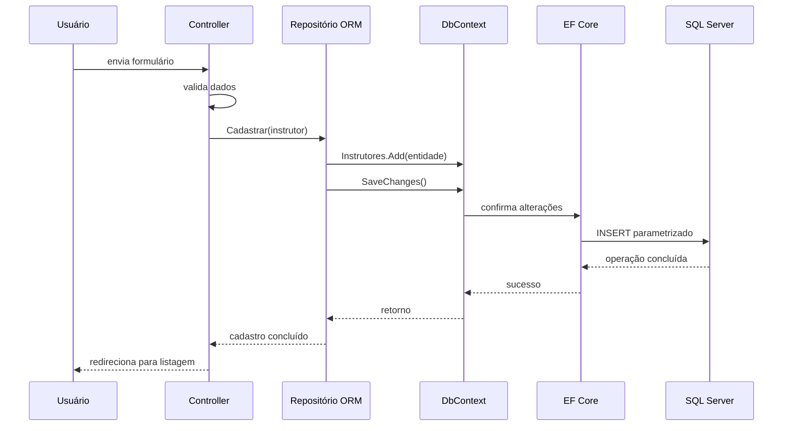
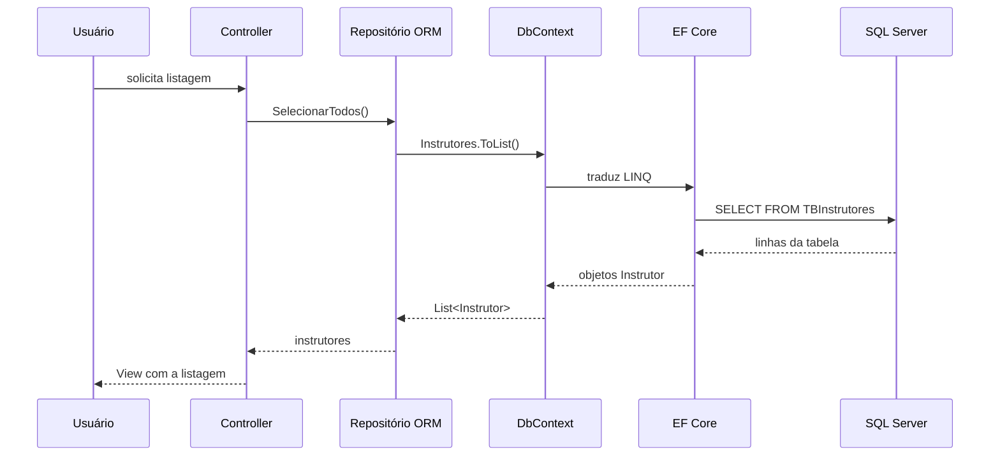
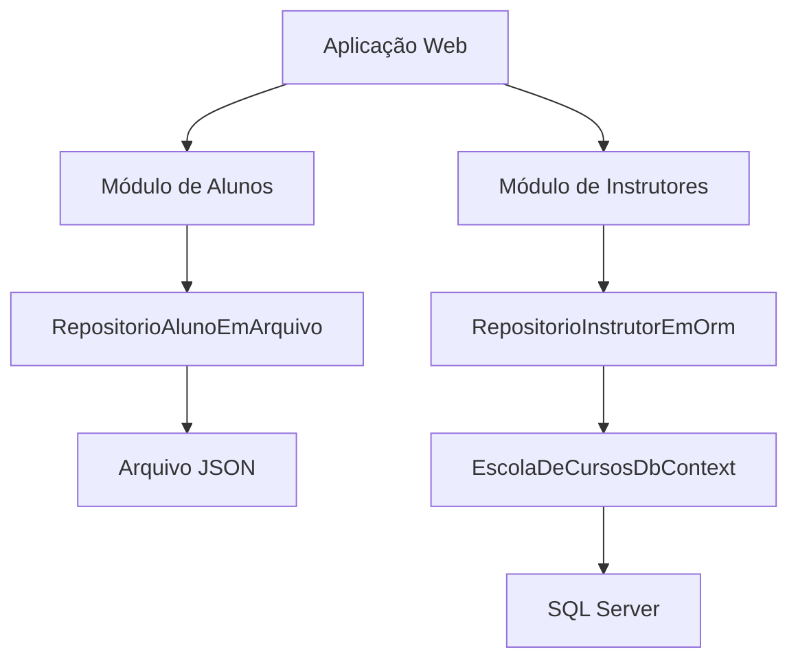

## Integração com SQL Server usando Entity Framework Core

Nas aulas anteriores, preparamos um SQL Server local utilizando Docker.

Também utilizamos o Dapper para executar comandos SQL e mapear os resultados para objetos C#.

Agora vamos conhecer outra forma de trabalhar com o banco de dados: o **Entity Framework Core**.

O Entity Framework Core, também chamado de **EF Core**, é um ORM completo para aplicações .NET.

ORM significa **Object-Relational Mapper**, ou mapeador objeto-relacional.

Ele ajuda a relacionar:

- classes e tabelas;
- propriedades e colunas;
- objetos e registros;
- consultas LINQ e comandos SQL.

O exemplo desta aula utiliza o projeto [`escola-de-cursos-2026`, versão `v1`](https://github.com/academiadoprogramador-backend/escola-de-cursos-2026/tree/v1).

Na versão utilizada como referência:

- o módulo de Instrutores utiliza o Entity Framework Core;
- o módulo de Alunos continua utilizando arquivo JSON;
- o SQL Server é configurado pela conexão `SqlServerDocker`;
- `EscolaDeCursosDbContext` representa o contexto de persistência;
- `InstrutorConfiguration` define o mapeamento da entidade;
- `RepositorioInstrutorEmOrm` executa as operações de persistência;
- a pasta `Migrations` registra a estrutura criada no banco.

Essa migração parcial é intencional.

Ela mostra que uma aplicação pode utilizar formas diferentes de persistência enquanto os módulos são migrados gradualmente.

Ao final, teremos este fluxo:


## O problema de executar todo o SQL manualmente

Na aula sobre Dapper, escrevemos comandos como:

```sql
SELECT Id, Nome, Telefone, Cpf
FROM TBInstrutores
WHERE Id = @Id;
```

Depois, o Dapper transformou as linhas retornadas em objetos `Instrutor`.

Essa abordagem é válida e oferece bastante controle.

Porém, quando a aplicação possui muitas entidades, o código pode crescer rapidamente.

Para cada tabela, o repositório pode precisar escrever:

- comandos `SELECT`;
- comandos `INSERT`;
- comandos `UPDATE`;
- comandos `DELETE`;
- parâmetros;
- mapeamentos entre colunas e propriedades;
- consultas para verificar relacionamentos;
- alterações na estrutura do banco.

O código também precisa acompanhar alterações como:

- adicionar uma propriedade a uma entidade;
- alterar o tamanho de uma coluna;
- criar um índice;
- adicionar uma chave estrangeira;
- renomear uma tabela.

Surge então uma pergunta:

> como trabalhar com tabelas relacionais utilizando objetos C# e reduzir a quantidade de SQL escrito manualmente?

## O que é o Entity Framework Core?

O Entity Framework Core é um ORM que permite trabalhar com o banco por meio de classes e objetos.

Em vez de escrever diretamente um `INSERT`, podemos adicionar uma entidade ao `DbContext`:

```csharp
dbContext.Instrutores.Add(instrutor);
dbContext.SaveChanges();
```

O EF Core acompanha a entidade e gera o comando SQL necessário quando `SaveChanges()` é executado.

Em uma consulta, podemos utilizar LINQ:

```csharp
List<Instrutor> instrutores = dbContext.Instrutores.ToList();
```

O EF Core traduz essa expressão para uma consulta SQL compatível com o provedor configurado.

Podemos resumir as responsabilidades assim:

| Componente | Responsabilidade |
| --- | --- |
| `Instrutor` | representar a entidade no código |
| `EscolaDeCursosDbContext` | organizar o acesso ao banco |
| `InstrutorConfiguration` | definir o mapeamento da entidade |
| Entity Framework Core | acompanhar objetos e gerar comandos |
| SQL Server | armazenar e consultar os dados |

> O EF Core não substitui o banco de dados. Ele é a biblioteca que conecta os objetos da aplicação às tabelas do banco.

## Dapper e Entity Framework Core

As duas bibliotecas ajudam a aplicação a conversar com o banco.

Mas elas possuem propostas diferentes.

No Dapper, o desenvolvedor normalmente escreve o SQL:

```csharp
const string query =
    "SELECT Id, Nome, Telefone, Cpf FROM TBInstrutores ORDER BY Nome";

return conexao.Query<Instrutor>(query).ToList();
```

No EF Core, a consulta pode ser escrita com LINQ:

```csharp
return dbContext.Instrutores
    .OrderBy(i => i.Nome)
    .ToList();
```

Uma comparação simples:

| Dapper | Entity Framework Core |
| --- | --- |
| micro-ORM | ORM completo |
| SQL escrito pelo desenvolvedor | SQL geralmente gerado pelo ORM |
| mapeamento explícito dos resultados | mapeamento definido no modelo |
| estrutura do banco gerenciada separadamente | migrations podem acompanhar o modelo |
| maior controle direto sobre o SQL | maior produtividade para operações comuns |

Nenhuma das abordagens é sempre melhor.

O Dapper pode ser útil quando:

- a consulta é muito específica;
- o SQL precisa ser controlado detalhadamente;
- o sistema já possui consultas SQL consolidadas;
- o resultado não corresponde diretamente a uma entidade.

O EF Core pode ser útil quando:

- a aplicação possui muitas operações CRUD;
- as entidades já estão representadas por classes;
- queremos acompanhar alterações nos objetos;
- desejamos versionar alterações do banco com migrations;
- consultas LINQ tornam o código mais simples.

Nesta aula, vamos utilizar o EF Core para persistir o módulo de Instrutores.

## Preparando o banco de dados

Na Semana 27, criamos o container local do SQL Server:

```text
sqlserver-local
```

Verifique se ele está em execução:

```bash
docker ps
```

O container deve apresentar um status semelhante a `Up`.

O SQL Server também precisa ter terminado a inicialização.

Confira os logs:

```bash
docker logs sqlserver-local
```

Aguarde uma mensagem semelhante a:

```text
SQL Server is now ready for client connections.
```

Na versão `v1` da Escola de Cursos, o banco utilizado se chama:

```text
EscolaDeCursosDB
```

A conexão usada no Docker é semelhante a esta:

```text
Server=localhost,1433;Database=EscolaDeCursosDB;User Id=sa;Password=Academia@2026!;TrustServerCertificate=True;MultipleActiveResultSets=True
```

> **Atenção:** a senha apresentada é apenas uma credencial de exemplo para desenvolvimento local. Não utilize esse valor em produção.

### Criando o banco

Caso o banco ainda não exista, podemos criá-lo com o `sqlcmd` dentro do container:

```bash
docker exec -it sqlserver-local \
  /opt/mssql-tools18/bin/sqlcmd \
  -S localhost \
  -U sa \
  -P 'Academia@2026!' \
  -C \
  -Q "IF DB_ID(N'EscolaDeCursosDB') IS NULL EXEC(N'CREATE DATABASE EscolaDeCursosDB');"
```

O trecho `IF DB_ID(...) IS NULL` evita tentar criar novamente um banco que já existe.

Não precisamos criar manualmente a tabela `TBInstrutores` neste momento.

Ela será criada pelo EF Core quando aplicarmos a migration do projeto.

## Conhecendo o projeto de referência

A estrutura principal do projeto `escola-de-cursos-2026` é semelhante a esta:

```text
WebApp/
├── Compartilhado/
│   ├── Apresentacao/
│   ├── Dominio/
│   └── Infraestrutura/
│       └── Orm/
│           └── EscolaDeCursosDbContext.cs
├── Migrations/
├── Modulos/
│   ├── ModuloAluno/
│   └── ModuloInstrutor/
│       ├── Dominio/
│       └── Infraestrutura/
│           ├── InstrutorConfiguration.cs
│           └── RepositorioInstrutorEmOrm.cs
├── Program.cs
├── appsettings.Development.json
└── EscolaDeCursos.WebApp.csproj
```

O projeto mantém a separação em módulos.

O ORM fica na infraestrutura compartilhada porque o `DbContext` é utilizado como parte da configuração geral de persistência.

O mapeamento específico de `Instrutor` permanece próximo ao módulo de Instrutores.

Essa organização evita misturar:

- regras do domínio;
- telas e Controllers;
- configuração do ORM;
- conexão com o banco.

## Instalando os pacotes do EF Core

O projeto de referência possui dois pacotes relacionados ao EF Core:

```xml
<ItemGroup>
  <PackageReference Include="Microsoft.EntityFrameworkCore.Design" Version="10.0.12">
    <IncludeAssets>runtime; build; native; contentfiles; analyzers; buildtransitive</IncludeAssets>
    <PrivateAssets>all</PrivateAssets>
  </PackageReference>
  <PackageReference Include="Microsoft.EntityFrameworkCore.SqlServer" Version="10.0.12" />
</ItemGroup>
```

Cada pacote possui uma função:

| Pacote | Finalidade |
| --- | --- |
| `Microsoft.EntityFrameworkCore.SqlServer` | permite utilizar o SQL Server como provedor |
| `Microsoft.EntityFrameworkCore.Design` | disponibiliza recursos para migrations e comandos de desenvolvimento |

Também podemos instalar os pacotes pelo terminal:

```bash
dotnet add WebApp/EscolaDeCursos.WebApp.csproj package Microsoft.EntityFrameworkCore.SqlServer --version 10.0.12
dotnet add WebApp/EscolaDeCursos.WebApp.csproj package Microsoft.EntityFrameworkCore.Design --version 10.0.12
```

Depois, restaure as dependências:

```bash
dotnet restore
```

O pacote `Microsoft.EntityFrameworkCore.SqlServer` é importante porque o EF Core precisa saber como gerar comandos compatíveis com o SQL Server.

O EF Core possui provedores para diferentes bancos.

O mesmo modelo pode utilizar outro provedor, mas cada banco possui particularidades próprias.

## Configurando a string de conexão

O arquivo `WebApp/appsettings.Development.json` da referência contém duas conexões:

```json
{
  "Logging": {
    "LogLevel": {
      "Default": "Information",
      "Microsoft.AspNetCore": "Warning"
    }
  },
  "ConnectionStrings": {
    "SqlServerLocalDB": "Server=(localdb)\\MSSQLLocalDB;Database=EscolaDeCursosDB;TrustServerCertificate=True;MultipleActiveResultSets=True",
    "SqlServerDocker": "Server=localhost,1433;Database=EscolaDeCursosDB;User Id=sa;Password=Academia@2026!;TrustServerCertificate=True;MultipleActiveResultSets=True"
  }
}
```

As conexões representam duas formas de acessar o SQL Server:

- `SqlServerLocalDB` utiliza o LocalDB do Windows;
- `SqlServerDocker` utiliza o container configurado na Semana 27.

Como a aula utiliza Docker, vamos selecionar `SqlServerDocker`.

O nome precisa ser exatamente igual ao utilizado no código:

```csharp
string? connectionString = configuration.GetConnectionString("SqlServerDocker");
```

Se o nome for diferente, a aplicação não encontrará a configuração.

> **Atenção:** não coloque senhas reais em arquivos versionados. Em aplicações reais, utilize User Secrets, variáveis de ambiente ou outro mecanismo de configuração segura.

## Criando o DbContext

O `DbContext` é a principal classe de comunicação entre a aplicação e o banco no EF Core.

Ele representa uma sessão de trabalho com o banco de dados.

No projeto, a classe é esta:

```csharp
using EscolaDeCursos.WebApp.Modulos.ModuloInstrutor.Dominio;
using EscolaDeCursos.WebApp.Modulos.ModuloInstrutor.Infraestrutura;
using Microsoft.EntityFrameworkCore;

namespace EscolaDeCursos.WebApp.Compartilhado.Infraestrutura.Orm;

public sealed class EscolaDeCursosDbContext : DbContext
{
    public DbSet<Instrutor> Instrutores => Set<Instrutor>();

    public EscolaDeCursosDbContext(
        DbContextOptions<EscolaDeCursosDbContext> options
    ) : base(options)
    {
    }

    protected override void OnModelCreating(ModelBuilder modelBuilder)
    {
        modelBuilder.ApplyConfiguration(new InstrutorConfiguration());
    }
}
```

Vamos observar as partes principais.

### Herdando de DbContext

```csharp
public sealed class EscolaDeCursosDbContext : DbContext
```

`DbContext` é a classe base fornecida pelo EF Core.

Ela fornece recursos para:

- consultar entidades;
- adicionar registros;
- alterar registros;
- remover registros;
- acompanhar alterações;
- salvar mudanças;
- aplicar configurações do modelo.

O nome `EscolaDeCursosDbContext` identifica o conjunto de entidades utilizado por essa aplicação.

### Declarando um DbSet

```csharp
public DbSet<Instrutor> Instrutores => Set<Instrutor>();
```

Um `DbSet<T>` representa a coleção de entidades do tipo `T` que podem ser consultadas e persistidas.

Neste caso:

```text
DbSet<Instrutor>
    representa os instrutores disponíveis no contexto
```

Podemos consultar essa propriedade com LINQ:

```csharp
List<Instrutor> instrutores = dbContext.Instrutores.ToList();
```

O EF Core traduz a consulta para SQL e executa o comando no SQL Server.

### Recebendo DbContextOptions

```csharp
public EscolaDeCursosDbContext(
    DbContextOptions<EscolaDeCursosDbContext> options
) : base(options)
{
}
```

As opções informam como o contexto deve funcionar.

Entre essas opções, podemos definir:

- qual provedor de banco será utilizado;
- qual string de conexão será usada;
- configurações de log;
- comportamento de consultas;
- estratégias de retry.

As opções são configuradas no container de injeção de dependência.

### Aplicando configurações

```csharp
protected override void OnModelCreating(ModelBuilder modelBuilder)
{
    modelBuilder.ApplyConfiguration(new InstrutorConfiguration());
}
```

O método `OnModelCreating` é chamado pelo EF Core quando o modelo da aplicação é construído.

O `InstrutorConfiguration` informa como a classe `Instrutor` deve ser representada no banco.

## Configurando a entidade Instrutor

A entidade da referência possui estas propriedades principais:

```csharp
public class Instrutor : EntidadeBase<Instrutor>
{
    public string Nome { get; set; } = string.Empty;
    public string Telefone { get; set; } = string.Empty;
    public string Cpf { get; set; } = string.Empty;
}
```

Ela também herda o `Id` da classe `EntidadeBase`:

```csharp
public abstract class EntidadeBase<T>
{
    public Guid Id { get; set; } = Guid.CreateVersion7();
}
```

O EF Core precisa saber como cada propriedade deve ser mapeada.

Para isso, a referência utiliza uma classe que implementa `IEntityTypeConfiguration<Instrutor>`:

```csharp
public sealed class InstrutorConfiguration
    : IEntityTypeConfiguration<Instrutor>
{
    public void Configure(EntityTypeBuilder<Instrutor> builder)
    {
        builder.ToTable("TBInstrutores");
    }
}
```

Essa abordagem concentra o mapeamento em um arquivo separado da entidade.

## Mapeando a tabela

A primeira configuração informa o nome da tabela:

```csharp
builder.ToTable("TBInstrutores");
```

Sem essa configuração, o EF Core poderia utilizar uma convenção baseada no nome da entidade.

Ao informar o nome explicitamente, deixamos claro que a classe `Instrutor` será armazenada na tabela:

```text
Instrutor
    classe C#

TBInstrutores
    tabela SQL Server
```

## Configurando a chave primária

O `Id` é a chave primária da entidade:

```csharp
builder.HasKey(i => i.Id);
```

Uma chave primária identifica cada registro de forma única.

No projeto, o identificador é um `Guid` criado pela própria aplicação:

```csharp
public Guid Id { get; set; } = Guid.CreateVersion7();
```

Por isso, a configuração informa que o valor não será gerado pelo banco:

```csharp
builder.Property(i => i.Id).ValueGeneratedNever();
```

O fluxo fica assim:

```text
Aplicação cria o Guid
        |
        v
Instrutor recebe o Id
        |
        v
EF Core envia o Id para o SQL Server
```

Esse comportamento é diferente de uma coluna `IDENTITY` do SQL Server, em que o próprio banco gera um número inteiro.

## Configurando propriedades obrigatórias

O nome do instrutor é configurado assim:

```csharp
builder.Property(i => i.Nome)
    .HasMaxLength(100)
    .IsRequired();
```

Essa configuração informa que:

- `Nome` é uma coluna obrigatória;
- o tamanho máximo é 100 caracteres;
- o valor não deve ser nulo no banco.

O telefone utiliza uma configuração semelhante:

```csharp
builder.Property(i => i.Telefone)
    .HasMaxLength(20)
    .IsRequired();
```

O CPF também é obrigatório:

```csharp
builder.Property(i => i.Cpf)
    .HasMaxLength(14)
    .IsRequired();
```

O tamanho 14 permite armazenar um CPF formatado:

```text
000.000.000-00
```

As configurações de domínio e banco possuem objetivos diferentes.

A validação da entidade pode informar que o valor possui formato inválido.

O mapeamento do EF Core informa como o valor será armazenado.

As duas proteções são importantes.

## Configurando índices únicos

O projeto não permite telefones repetidos:

```csharp
builder.HasIndex(i => i.Telefone)
    .IsUnique();
```

Também não permite CPFs repetidos:

```csharp
builder.HasIndex(i => i.Cpf)
    .IsUnique();
```

Um índice único cria uma regra no banco de dados.

Mesmo que a aplicação tenha um problema e tente cadastrar um valor repetido, o SQL Server poderá rejeitar a operação.

Podemos visualizar a estrutura esperada:

```text
TBInstrutores
    Id          chave primária
    Nome        obrigatório, até 100 caracteres
    Telefone    obrigatório, até 20 caracteres, único
    Cpf         obrigatório, até 14 caracteres, único
```

## A configuração completa da entidade

Juntando as partes, o mapeamento da referência fica assim:

```csharp
using EscolaDeCursos.WebApp.Modulos.ModuloInstrutor.Dominio;
using Microsoft.EntityFrameworkCore;
using Microsoft.EntityFrameworkCore.Metadata.Builders;

namespace EscolaDeCursos.WebApp.Modulos.ModuloInstrutor.Infraestrutura;

public sealed class InstrutorConfiguration
    : IEntityTypeConfiguration<Instrutor>
{
    public void Configure(EntityTypeBuilder<Instrutor> builder)
    {
        builder.ToTable("TBInstrutores");

        builder.HasKey(i => i.Id);
        builder.Property(i => i.Id).ValueGeneratedNever();

        builder.Property(i => i.Nome)
            .HasMaxLength(100)
            .IsRequired();

        builder.Property(i => i.Telefone)
            .HasMaxLength(20)
            .IsRequired();

        builder.Property(i => i.Cpf)
            .HasMaxLength(14)
            .IsRequired();

        builder.HasIndex(i => i.Telefone)
            .IsUnique();

        builder.HasIndex(i => i.Cpf)
            .IsUnique();
    }
}
```

O `DbContext` aplica essa configuração:

```csharp
modelBuilder.ApplyConfiguration(new InstrutorConfiguration());
```

Assim, a entidade e a tabela permanecem conectadas sem colocar detalhes de banco dentro da classe de domínio.

## Registrando o DbContext no container

O `DbContext` precisa ser registrado na injeção de dependência.

Na infraestrutura, a referência possui uma extensão semelhante a esta:

```csharp
using EscolaDeCursos.WebApp.Compartilhado.Infraestrutura.Orm;
using Microsoft.EntityFrameworkCore;

namespace EscolaDeCursos.WebApp.Compartilhado.Infraestrutura;

public static class InjecaoDependencia
{
    public static void AddInfraRepositories(
        this IServiceCollection services,
        IConfiguration configuration
    )
    {
        services.AddDbContext<EscolaDeCursosDbContext>(options =>
        {
            string? connectionString =
                configuration.GetConnectionString("SqlServerDocker");

            if (string.IsNullOrWhiteSpace(connectionString))
            {
                throw new InvalidOperationException(
                    "A Connection String \"SqlServerDocker\" não foi encontrada"
                );
            }

            options.UseSqlServer(connectionString);
        });

        services.AddScoped<IRepositorioInstrutor, RepositorioInstrutorEmOrm>();
    }
}
```

Vamos observar as duas partes principais.

### Recuperando a conexão

```csharp
string? connectionString =
    configuration.GetConnectionString("SqlServerDocker");
```

O nome precisa existir no arquivo de configuração.

Se a configuração não estiver disponível, lançar uma exceção durante a inicialização ajuda a identificar o problema rapidamente.

### Selecionando o provedor SQL Server

```csharp
options.UseSqlServer(connectionString);
```

Esse método informa ao EF Core que o banco utiliza SQL Server.

O provedor passa a conhecer as particularidades do banco, como:

- tipos de dados;
- sintaxe SQL;
- criação de índices;
- criação de tabelas;
- aplicação de migrations.

### Escolhendo o tempo de vida

`AddDbContext` registra o contexto como `Scoped` por padrão.

Isso significa que uma instância normalmente será utilizada durante uma requisição HTTP.

Essa duração é adequada para o padrão de unidade de trabalho:

```text
Requisição HTTP
    cria um DbContext

Controller e repositório
    utilizam o mesmo contexto

Fim da requisição
    contexto é descartado
```

Não devemos manter um `DbContext` global por toda a aplicação.

O contexto acompanha alterações e não deve ser compartilhado entre requisições diferentes.

## Registrando o repositório ORM

Depois de registrar o contexto, registramos o repositório:

```csharp
services.AddScoped<IRepositorioInstrutor, RepositorioInstrutorEmOrm>();
```

O Controller depende da interface:

```csharp
public InstrutorController(IRepositorioInstrutor repositorio)
{
    this.repositorio = repositorio;
}
```

O container monta as dependências:

```text
InstrutorController
        |
        | precisa de IRepositorioInstrutor
        v
RepositorioInstrutorEmOrm
        |
        | precisa de EscolaDeCursosDbContext
        v
EscolaDeCursosDbContext
        |
        v
SQL Server
```

O Controller não precisa conhecer:

- o nome da tabela;
- a string de conexão;
- o provedor SQL Server;
- as migrations;
- a forma como o EF Core acompanha as entidades.

## Criando o repositório com EF Core

O repositório recebe o `DbContext` pelo construtor:

```csharp
public sealed class RepositorioInstrutorEmOrm
    : IRepositorioInstrutor
{
    private readonly EscolaDeCursosDbContext dbContext;

    public RepositorioInstrutorEmOrm(
        EscolaDeCursosDbContext dbContext
    )
    {
        this.dbContext = dbContext;
    }
}
```

O repositório não cria uma conexão manualmente.

Também não precisa instanciar o `DbContext` com `new`.

O container fornece a instância configurada.

## Cadastrando um instrutor

Para adicionar uma entidade, usamos o `DbSet`:

```csharp
public void Cadastrar(Instrutor entidade)
{
    dbContext.Instrutores.Add(entidade);

    dbContext.SaveChanges();
}
```

O método `Add` informa ao contexto que a entidade deve ser inserida.

O comando SQL ainda não precisa ser enviado imediatamente.

O `SaveChanges()` confirma as alterações:

```text
Instrutor
    objeto em memória

Add
    entidade marcada para inserção

SaveChanges
    EF Core gera e executa o INSERT
```

Podemos imaginar um SQL semelhante a este:

```sql
INSERT INTO TBInstrutores (Id, Nome, Telefone, Cpf)
VALUES (@Id, @Nome, @Telefone, @Cpf);
```

O SQL exato depende do provedor, da versão e das configurações do modelo.

Por isso, não devemos tratar o SQL imaginado como uma garantia da implementação interna.

## Consultando por identificador

O método da referência utiliza `SingleOrDefault`:

```csharp
public Instrutor? SelecionarPorId(Guid idSelecionado)
{
    return dbContext.Instrutores
        .SingleOrDefault(i => i.Id == idSelecionado);
}
```

O EF Core converte a expressão LINQ em uma consulta SQL.

O resultado será:

- um `Instrutor`, quando houver exatamente um registro;
- `null`, quando não houver registro;
- uma exceção, caso existam vários registros para o mesmo identificador.

Como `Id` é chave primária, esperamos no máximo um registro.

O filtro é executado no banco.

Não carregamos todos os instrutores para depois procurar em memória.

Essa diferença é importante:

```csharp
// Consulta filtrada no banco
return dbContext.Instrutores
    .SingleOrDefault(i => i.Id == idSelecionado);
```

Em uma consulta LINQ sobre um `IQueryable`, a expressão normalmente é traduzida para SQL.

## Listando os instrutores

O método para listar todos os registros é pequeno:

```csharp
public List<Instrutor> SelecionarTodos()
{
    return dbContext.Instrutores.ToList();
}
```

Podemos ordenar os dados antes de materializar a consulta:

```csharp
public List<Instrutor> SelecionarTodos()
{
    return dbContext.Instrutores
        .OrderBy(i => i.Nome)
        .ToList();
}
```

É importante colocar `OrderBy` antes de `ToList`.

Assim, a ordenação pode ser realizada pelo SQL Server.

Considere a diferença:

```csharp
// Ordenação traduzida para o banco
dbContext.Instrutores
    .OrderBy(i => i.Nome)
    .ToList();
```

```csharp
// Todos os registros são carregados antes da ordenação
dbContext.Instrutores
    .ToList()
    .OrderBy(i => i.Nome)
    .ToList();
```

Na segunda forma, os dados já foram carregados para a memória antes da ordenação.

Para tabelas grandes, isso pode consumir mais memória e transferir dados desnecessários.

## Editando um instrutor

A referência localiza a entidade e chama seu método de atualização:

```csharp
public bool Editar(
    Guid idSelecionado,
    Instrutor entidadeAtualizada
)
{
    Instrutor? instrutor = SelecionarPorId(idSelecionado);

    if (instrutor == null)
        return false;

    instrutor.Atualizar(entidadeAtualizada);

    dbContext.SaveChanges();

    return true;
}
```

O EF Core acompanha a entidade retornada por `SelecionarPorId`.

Quando o método `Atualizar` altera as propriedades, o contexto identifica a mudança.

Ao executar `SaveChanges()`, o EF Core gera um `UPDATE` para o registro.

O fluxo é:

```text
Consulta
    EF Core busca o instrutor

Alteração
    o objeto acompanhado muda em memória

SaveChanges
    EF Core compara o estado e gera UPDATE
```

Não precisamos escrever manualmente:

```sql
UPDATE TBInstrutores
SET Nome = @Nome,
    Telefone = @Telefone,
    Cpf = @Cpf
WHERE Id = @Id;
```

O ORM gera o comando a partir do estado acompanhado.

## Excluindo um instrutor

Para excluir, localizamos o registro e utilizamos `Remove`:

```csharp
public bool Excluir(Guid idSelecionado)
{
    Instrutor? instrutor = SelecionarPorId(idSelecionado);

    if (instrutor == null)
        return false;

    dbContext.Instrutores.Remove(instrutor);
    dbContext.SaveChanges();

    return true;
}
```

O método `Remove` marca a entidade para exclusão.

O `SaveChanges()` confirma a operação no banco.

O SQL gerado será equivalente a:

```sql
DELETE FROM TBInstrutores
WHERE Id = @Id;
```

O repositório não precisa concatenar valores na consulta.

O EF Core utiliza parâmetros ao enviar os valores para o SQL Server.

## Verificando valores existentes

O repositório da referência possui uma consulta para verificar nomes repetidos:

```csharp
public bool ExisteComNome(
    string nome,
    Guid? idIgnorado = null
)
{
    return dbContext.Instrutores.Any(i =>
        i.Id != idIgnorado &&
        i.Nome.Trim() == nome.Trim()
    );
}
```

O método `Any` verifica se existe pelo menos um registro que atende à condição.

Ele não precisa carregar todos os instrutores para a memória.

O EF Core pode transformar essa expressão em uma consulta semelhante a:

```sql
SELECT CASE
    WHEN EXISTS (
        SELECT 1
        FROM TBInstrutores
        WHERE ...
    )
    THEN CAST(1 AS bit)
    ELSE CAST(0 AS bit)
END;
```

O SQL exato pode variar.

O ponto importante é que a verificação é realizada no banco.

O parâmetro `idIgnorado` é útil durante uma edição.

Ao editar um instrutor, o próprio registro não deve ser considerado uma duplicidade.

## O repositório completo

Juntando as operações, temos uma implementação semelhante à referência:

```csharp
using EscolaDeCursos.WebApp.Compartilhado.Infraestrutura.Orm;
using EscolaDeCursos.WebApp.Modulos.ModuloInstrutor.Dominio;

namespace EscolaDeCursos.WebApp.Modulos.ModuloInstrutor.Infraestrutura;

public sealed class RepositorioInstrutorEmOrm
    : IRepositorioInstrutor
{
    private readonly EscolaDeCursosDbContext dbContext;

    public RepositorioInstrutorEmOrm(
        EscolaDeCursosDbContext dbContext
    )
    {
        this.dbContext = dbContext;
    }

    public void Cadastrar(Instrutor entidade)
    {
        dbContext.Instrutores.Add(entidade);
        dbContext.SaveChanges();
    }

    public bool Editar(
        Guid idSelecionado,
        Instrutor entidadeAtualizada
    )
    {
        Instrutor? instrutor = SelecionarPorId(idSelecionado);

        if (instrutor == null)
            return false;

        instrutor.Atualizar(entidadeAtualizada);
        dbContext.SaveChanges();

        return true;
    }

    public bool Excluir(Guid idSelecionado)
    {
        Instrutor? instrutor = SelecionarPorId(idSelecionado);

        if (instrutor == null)
            return false;

        dbContext.Instrutores.Remove(instrutor);
        dbContext.SaveChanges();

        return true;
    }

    public Instrutor? SelecionarPorId(Guid idSelecionado)
    {
        return dbContext.Instrutores
            .SingleOrDefault(i => i.Id == idSelecionado);
    }

    public List<Instrutor> SelecionarTodos()
    {
        return dbContext.Instrutores.ToList();
    }

    public bool ExisteComNome(
        string nome,
        Guid? idIgnorado = null
    )
    {
        return dbContext.Instrutores.Any(i =>
            i.Id != idIgnorado &&
            i.Nome.Trim() == nome.Trim()
        );
    }
}
```

Observe que o repositório possui responsabilidades relacionadas à persistência:

- consultar o `DbSet`;
- adicionar entidades;
- remover entidades;
- consultar com LINQ;
- confirmar alterações com `SaveChanges`.

Ele não deve:

- receber diretamente uma requisição HTTP;
- retornar uma View;
- montar mensagens de tela;
- decidir como o formulário será exibido;
- validar regras específicas da apresentação.

## O que é uma migration?

Uma **migration** é um registro versionado de uma alteração na estrutura do banco de dados.

Ela representa a diferença entre um modelo anterior e um modelo novo.

Por exemplo, podemos criar uma migration para:

- criar a tabela `TBInstrutores`;
- adicionar a coluna `Cpf`;
- criar um índice único;
- alterar o tamanho de uma coluna;
- adicionar uma chave estrangeira.

O EF Core utiliza o modelo configurado no código para gerar essa alteração.

Uma migration não é apenas um script solto.

Ela também registra informações que permitem ao EF Core controlar quais alterações já foram aplicadas.

## Criando uma migration

Para utilizar os comandos `dotnet ef`, instale a ferramenta caso ainda não esteja disponível:

```bash
dotnet tool install --global dotnet-ef
```

Se a ferramenta já estiver instalada, podemos atualizá-la:

```bash
dotnet tool update --global dotnet-ef
```

Na pasta raiz do projeto, execute:

```bash
dotnet ef migrations add Add_TBInstrutores \
  --project WebApp/EscolaDeCursos.WebApp.csproj \
  --output-dir Migrations
```

O comando analisa:

- as entidades conhecidas pelo `DbContext`;
- as configurações do `OnModelCreating`;
- o snapshot atual do modelo;
- a alteração que precisa ser registrada.

Na referência, a migration possui um nome semelhante a:

```text
20260917233020_Add_TBInstrutores.cs
```

O prefixo representa o momento em que a migration foi criada.

O nome `Add_TBInstrutores` descreve a alteração.

Prefira nomes que expliquem a mudança realizada.

Exemplos:

```text
Add_TBInstrutores
Add_CpfUniqueIndex
Add_TBAlunos
```

## Arquivos gerados pela migration

Uma migration normalmente gera ou atualiza arquivos como:

```text
Migrations/
├── 20260917233020_Add_TBInstrutores.cs
├── 20260917233020_Add_TBInstrutores.Designer.cs
└── EscolaDeCursosDbContextModelSnapshot.cs
```

O arquivo principal possui os métodos `Up` e `Down`.

O método `Up` descreve como aplicar a alteração:

```csharp
protected override void Up(MigrationBuilder migrationBuilder)
{
    migrationBuilder.CreateTable(
        name: "TBInstrutores",
        columns: table => new
        {
            Id = table.Column<Guid>(
                type: "uniqueidentifier",
                nullable: false
            ),
            Nome = table.Column<string>(
                type: "nvarchar(100)",
                maxLength: 100,
                nullable: false
            )
        }
    );
}
```

O método `Down` descreve como desfazer a alteração:

```csharp
protected override void Down(MigrationBuilder migrationBuilder)
{
    migrationBuilder.DropTable(
        name: "TBInstrutores"
    );
}
```

O arquivo `.Designer.cs` contém informações auxiliares do modelo.

O `ModelSnapshot` registra o estado conhecido do modelo após a migration.

Quando uma nova migration é criada, o EF Core compara o modelo atual com esse snapshot.

> **Atenção:** não edite migrations já aplicadas como se fossem arquivos temporários. Quando o modelo mudar, crie uma nova migration.

## Aplicando a migration ao SQL Server

Para aplicar as migrations pendentes, execute:

```bash
dotnet ef database update \
  --project WebApp/EscolaDeCursos.WebApp.csproj
```

O EF Core:

1. lê a string de conexão configurada;
2. conecta ao banco `EscolaDeCursosDB`;
3. verifica quais migrations já foram aplicadas;
4. executa as migrations pendentes;
5. registra a migration aplicada no banco.

Depois desse comando, o SQL Server deve possuir:

- a tabela `TBInstrutores`;
- a chave primária de `Id`;
- as colunas obrigatórias;
- o índice único de `Telefone`;
- o índice único de `Cpf`.

O EF Core mantém uma tabela interna para registrar as migrations aplicadas.

Essa tabela permite que o comando seja executado novamente sem repetir alterações já aplicadas.

## Consultando as tabelas criadas

Podemos verificar a estrutura usando o `sqlcmd`:

```bash
docker exec -it sqlserver-local \
  /opt/mssql-tools18/bin/sqlcmd \
  -S localhost \
  -U sa \
  -P 'Academia@2026!' \
  -C \
  -d EscolaDeCursosDB \
  -Q "SELECT TABLE_NAME FROM INFORMATION_SCHEMA.TABLES ORDER BY TABLE_NAME;"
```

Para verificar as colunas de `TBInstrutores`:

```bash
docker exec -it sqlserver-local \
  /opt/mssql-tools18/bin/sqlcmd \
  -S localhost \
  -U sa \
  -P 'Academia@2026!' \
  -C \
  -d EscolaDeCursosDB \
  -Q "SELECT COLUMN_NAME, DATA_TYPE, CHARACTER_MAXIMUM_LENGTH, IS_NULLABLE FROM INFORMATION_SCHEMA.COLUMNS WHERE TABLE_NAME = 'TBInstrutores' ORDER BY ORDINAL_POSITION;"
```

Também podemos consultar os registros:

```bash
docker exec -it sqlserver-local \
  /opt/mssql-tools18/bin/sqlcmd \
  -S localhost \
  -U sa \
  -P 'Academia@2026!' \
  -C \
  -d EscolaDeCursosDB \
  -Q "SELECT Id, Nome, Telefone, Cpf FROM dbo.TBInstrutores ORDER BY Nome;"
```

## O fluxo de uma requisição

Quando o usuário cadastra um instrutor, o fluxo é semelhante a este:



Na listagem, o fluxo é diferente:



O SQL Server não é acessado diretamente pela View.

O Controller também não precisa conhecer os detalhes do EF Core.

## Persistência em JSON e SQL Server ao mesmo tempo

Na versão `v1`, os módulos utilizam formas diferentes de persistência:



Isso é possível porque cada módulo depende de seu próprio contrato de repositório.

O Controller de Alunos pode receber `IRepositorioAluno` com implementação em arquivo.

O Controller de Instrutores recebe `IRepositorioInstrutor` com implementação usando EF Core.

A aplicação não precisa migrar todos os módulos de uma única vez.

Essa estratégia facilita a evolução gradual:

1. escolher um módulo;
2. criar o mapeamento da entidade;
3. registrar o `DbContext`;
4. criar e aplicar a migration;
5. trocar a implementação do repositório;
6. testar o módulo;
7. migrar o próximo módulo.

## O que o EF Core acompanha?

O `DbContext` mantém um controle das entidades que foram consultadas ou adicionadas.

Esse controle é chamado de **change tracking**, ou acompanhamento de alterações.

Uma entidade consultada pode possuir estados como:

| Estado | Significado |
| --- | --- |
| `Detached` | não está sendo acompanhada pelo contexto |
| `Unchanged` | foi consultada e não foi alterada |
| `Added` | será inserida no banco |
| `Modified` | possui alterações que serão atualizadas |
| `Deleted` | será removida do banco |

Por exemplo:

```csharp
dbContext.Instrutores.Add(instrutor);
```

marca a entidade como `Added`.

Depois:

```csharp
dbContext.SaveChanges();
```

confirma a inserção.

Quando consultamos um instrutor e alteramos uma propriedade, o contexto pode identificar a mudança:

```csharp
Instrutor? instrutor = SelecionarPorId(id);

if (instrutor != null)
{
    instrutor.Nome = "Novo nome";
    dbContext.SaveChanges();
}
```

Não é necessário chamar um método `Update` nesse caso, pois a entidade já está sendo acompanhada pelo contexto.

## LINQ é executado no banco?

Depende do momento em que a consulta é materializada.

Enquanto trabalhamos com o `DbSet`, a consulta ainda pode ser traduzida:

```csharp
IQueryable<Instrutor> consulta = dbContext.Instrutores
    .Where(i => i.Nome.Contains("Ana"));
```

O comando SQL normalmente será executado quando chamarmos um método como:

```csharp
List<Instrutor> resultado = consulta.ToList();
```

Outros métodos que materializam ou executam a consulta incluem:

- `ToList()`;
- `SingleOrDefault()`;
- `FirstOrDefault()`;
- `Any()`;
- `Count()`;
- `SaveChanges()` para alterações acompanhadas.

Podemos continuar filtrando antes da materialização:

```csharp
List<Instrutor> resultado = dbContext.Instrutores
    .Where(i => i.Nome.Contains("Ana"))
    .OrderBy(i => i.Nome)
    .ToList();
```

Essa consulta permite que o banco filtre e ordene os dados.

Depois de chamar `ToList`, o resultado é uma lista em memória.

```csharp
List<Instrutor> todos = dbContext.Instrutores.ToList();

List<Instrutor> resultado = todos
    .Where(i => i.Nome.Contains("Ana"))
    .ToList();
```

Nesse segundo exemplo, todos os registros foram carregados antes do filtro.

Para tabelas pequenas, a diferença pode parecer irrelevante.

Em uma aplicação real, a quantidade de dados pode tornar essa escolha importante.

## Consultas somente de leitura

Quando uma consulta não precisa alterar as entidades, podemos utilizar `AsNoTracking`:

```csharp
public List<Instrutor> SelecionarTodos()
{
    return dbContext.Instrutores
        .AsNoTracking()
        .OrderBy(i => i.Nome)
        .ToList();
}
```

Essa opção informa que o contexto não precisa acompanhar as entidades retornadas.

Ela pode reduzir o trabalho do contexto em consultas de leitura.

Porém, se depois for necessário alterar e salvar uma entidade retornada dessa forma, será necessário anexá-la ou consultar uma entidade acompanhada.

Na primeira implementação do projeto, podemos utilizar a consulta padrão para manter o exemplo mais simples.

## Tratando valores duplicados

Como `Telefone` e `Cpf` possuem índices únicos, o SQL Server rejeitará duplicidades.

Antes de chamar `SaveChanges`, a aplicação também pode verificar os dados e apresentar uma mensagem mais clara ao usuário.

Mesmo assim, a regra do banco continua importante.

Existe uma diferença entre:

- validação amigável na aplicação;
- restrição definitiva no banco.

Uma validação no Controller pode evitar uma tentativa conhecida.

O índice único impede que uma condição de concorrência permita dois registros iguais.

> **Atenção:** a validação da aplicação melhora a mensagem para o usuário, mas não substitui a restrição de unicidade do banco.

Se `SaveChanges()` falhar por causa de uma restrição do SQL Server, a aplicação deve tratar a exceção de acordo com a regra do projeto.

Não devemos esconder qualquer exceção sem entender sua causa.

## Problemas comuns

### O comando `dotnet ef` não foi encontrado

Instale a ferramenta:

```bash
dotnet tool install --global dotnet-ef
```

Depois, abra um novo terminal se o sistema não reconhecer o comando imediatamente.

Também é possível verificar a instalação:

```bash
dotnet ef --version
```

### O pacote Design não foi encontrado

Confirme se o projeto possui:

```xml
<PackageReference Include="Microsoft.EntityFrameworkCore.Design" Version="10.0.12" />
```

Depois execute:

```bash
dotnet restore
```

### A string de conexão não foi encontrada

Confira:

- se o arquivo é `appsettings.Development.json`;
- se existe a seção `ConnectionStrings`;
- se o nome é `SqlServerDocker`;
- se o ambiente de desenvolvimento está sendo utilizado;
- se o código procura exatamente esse nome.

O nome precisa coincidir nos dois lugares:

```json
"SqlServerDocker": "..."
```

```csharp
configuration.GetConnectionString("SqlServerDocker")
```

### O EF Core não consegue conectar

Verifique:

- se o container `sqlserver-local` está em execução;
- se o SQL Server informou que está pronto;
- se a porta publicada é `1433`;
- se o banco se chama `EscolaDeCursosDB`;
- se o usuário é `sa`;
- se a senha coincide com a do container;
- se `TrustServerCertificate=True` está presente no ambiente local.

### A migration não encontra o DbContext

Confira:

- se o projeto correto foi informado com `--project`;
- se a classe herda de `DbContext`;
- se o construtor recebe `DbContextOptions<EscolaDeCursosDbContext>`;
- se o projeto compila;
- se o `DbContext` está registrado na aplicação.

Se a solução possuir mais de um projeto, pode ser necessário informar também o projeto de inicialização:

```bash
dotnet ef migrations add Add_TBInstrutores \
  --project WebApp/EscolaDeCursos.WebApp.csproj \
  --startup-project WebApp/EscolaDeCursos.WebApp.csproj \
  --output-dir Migrations
```

### A tabela `TBInstrutores` não existe

A migration pode ter sido criada, mas ainda não aplicada.

Execute:

```bash
dotnet ef database update \
  --project WebApp/EscolaDeCursos.WebApp.csproj
```

Também confira se a aplicação e o comando estão utilizando a mesma conexão.

### O nome da tabela está diferente

Verifique se a configuração possui:

```csharp
builder.ToTable("TBInstrutores");
```

Se o nome for alterado depois que a migration já foi criada, crie uma nova migration em vez de apenas alterar o arquivo antigo.

### O cadastro falha por valor duplicado

O telefone ou o CPF já pode existir no banco.

Consulte os registros:

```bash
docker exec -it sqlserver-local \
  /opt/mssql-tools18/bin/sqlcmd \
  -S localhost \
  -U sa \
  -P 'Academia@2026!' \
  -C \
  -d EscolaDeCursosDB \
  -Q "SELECT Id, Nome, Telefone, Cpf FROM dbo.TBInstrutores;"
```

Também confira os índices únicos criados pela migration.

### A alteração não foi salva

Verifique se o repositório chamou:

```csharp
dbContext.SaveChanges();
```

Métodos como `Add` e `Remove` alteram o estado no contexto.

Eles não confirmam a alteração no banco sozinhos.

### A aplicação utiliza JSON em vez do SQL Server

Confira o registro da implementação:

```csharp
services.AddScoped<IRepositorioInstrutor, RepositorioInstrutorEmOrm>();
```

Se a aplicação estiver registrada com `RepositorioInstrutorEmArquivo`, o módulo continuará utilizando arquivo JSON.

## Executando e testando a aplicação

Depois de configurar o banco e aplicar as migrations, restaure e execute o projeto:

```bash
dotnet restore
dotnet run --project WebApp/EscolaDeCursos.WebApp.csproj
```

Teste as operações do módulo de Instrutores:

1. Acesse a listagem de instrutores.
2. Cadastre um instrutor válido.
3. Confirme se ele aparece na tela.
4. Consulte a tabela `TBInstrutores` no SQL Server.
5. Edite o nome ou outro campo.
6. Confirme se a alteração foi persistida.
7. Tente cadastrar um telefone repetido.
8. Tente cadastrar um CPF repetido.
9. Exclua um instrutor.
10. Confirme se o registro foi removido do banco.

Para verificar os registros diretamente:

```bash
docker exec -it sqlserver-local \
  /opt/mssql-tools18/bin/sqlcmd \
  -S localhost \
  -U sa \
  -P 'Academia@2026!' \
  -C \
  -d EscolaDeCursosDB \
  -Q "SELECT Id, Nome, Telefone, Cpf FROM dbo.TBInstrutores ORDER BY Nome;"
```

Também é importante testar o módulo de Alunos.

Ele deve continuar utilizando o repositório em arquivo na versão de referência.

Assim verificamos que a migração de Instrutores não alterou o comportamento dos outros módulos.

## Checklist

Antes de considerar a integração concluída, verifique se:

- o container SQL Server está em execução;
- o banco `EscolaDeCursosDB` existe;
- o pacote `Microsoft.EntityFrameworkCore.SqlServer` foi instalado;
- o pacote `Microsoft.EntityFrameworkCore.Design` foi instalado;
- o projeto possui a conexão `SqlServerDocker`;
- o `DbContext` herda de `DbContext`;
- o `DbContext` possui `DbSet<Instrutor>`;
- o `DbContext` aplica `InstrutorConfiguration`;
- a entidade utiliza a tabela `TBInstrutores`;
- `Id` é a chave primária;
- `Nome`, `Telefone` e `Cpf` são obrigatórios;
- `Telefone` possui índice único;
- `Cpf` possui índice único;
- o `DbContext` foi registrado com `AddDbContext`;
- o provedor foi configurado com `UseSqlServer`;
- `IRepositorioInstrutor` utiliza `RepositorioInstrutorEmOrm`;
- a migration foi criada;
- a migration foi aplicada com `database update`;
- o cadastro chama `Add` e `SaveChanges`;
- a edição consulta uma entidade e chama `SaveChanges`;
- a exclusão chama `Remove` e `SaveChanges`;
- a listagem utiliza LINQ sobre o `DbSet`;
- os registros aparecem na tabela do SQL Server;
- o módulo de Alunos continua funcionando com JSON.

## Conclusão

O Entity Framework Core permite integrar uma aplicação ASP.NET ao SQL Server utilizando classes, objetos e consultas LINQ.

Nesta aula:

- conhecemos a diferença entre Dapper e EF Core;
- instalamos o provedor do SQL Server;
- configuramos a string de conexão;
- criamos o `EscolaDeCursosDbContext`;
- adicionamos um `DbSet<Instrutor>`;
- configuramos tabela, colunas, chave primária e índices;
- registramos o contexto na injeção de dependência;
- implementamos cadastro, consulta, edição e exclusão;
- conhecemos o acompanhamento de alterações;
- criamos e aplicamos uma migration;
- mantivemos o módulo de Alunos utilizando JSON;
- migramos apenas o módulo de Instrutores para o SQL Server.

O fluxo principal pode ser resumido assim:

```text
Entidade Instrutor
    representa o registro no código C#

InstrutorConfiguration
    define o mapeamento para TBInstrutores

EscolaDeCursosDbContext
    organiza consultas e alterações

Entity Framework Core
    traduz LINQ e alterações para comandos SQL

SQL Server
    armazena os registros e aplica as restrições
```

O ORM reduz a quantidade de SQL escrito manualmente.

Mesmo assim, ainda precisamos compreender:

- o modelo de dados;
- as chaves e os índices;
- as migrations;
- o ciclo de vida do `DbContext`;
- o momento em que uma consulta é executada;
- as regras que pertencem ao banco e à aplicação.

Para consultar a implementação utilizada como referência, veja o repositório [`escola-de-cursos-2026`, versão `v1`](https://github.com/academiadoprogramador-backend/escola-de-cursos-2026/tree/v1).
